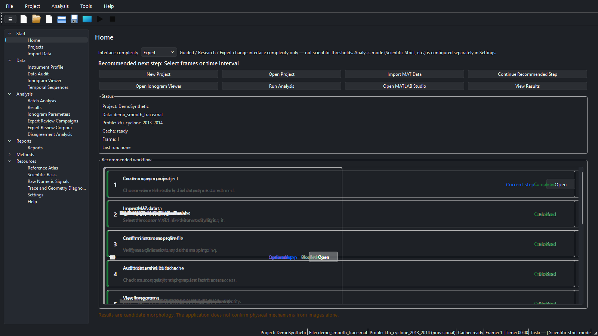
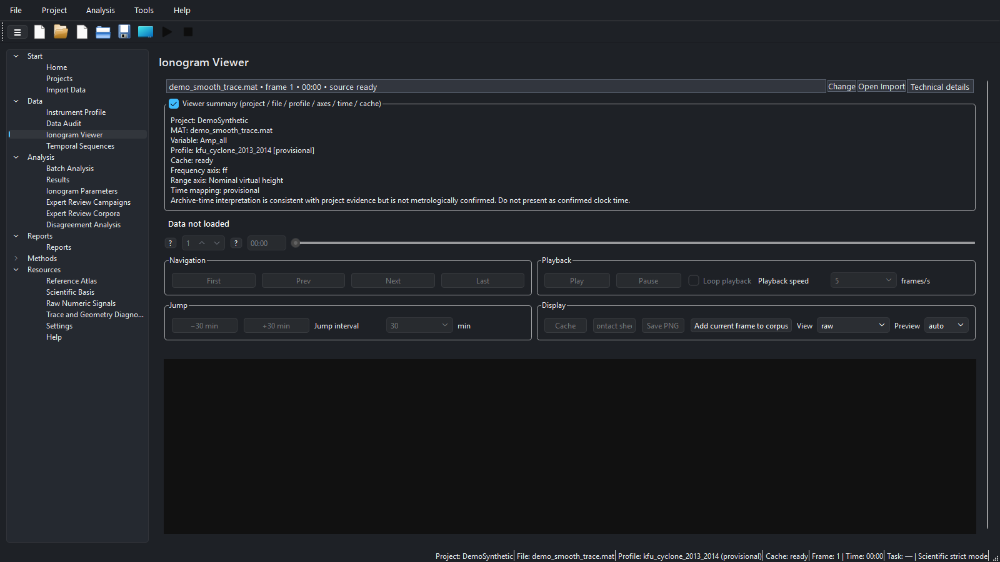
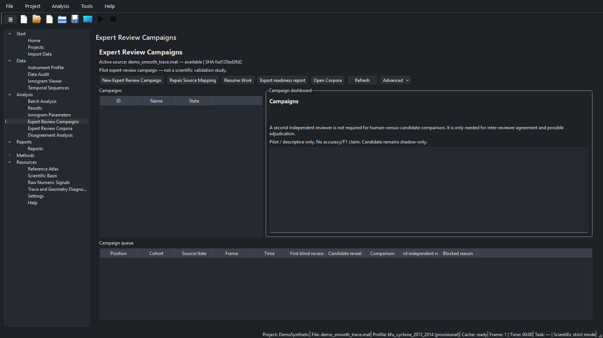
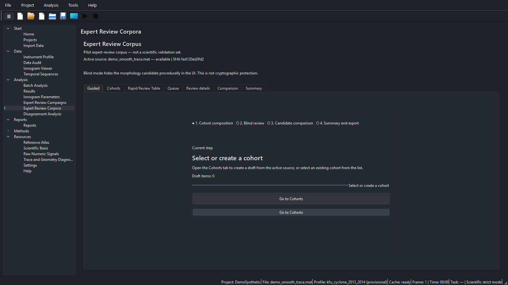
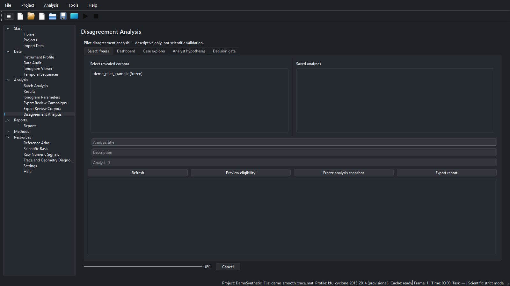
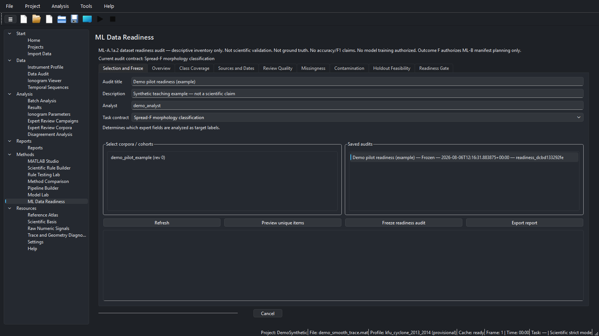
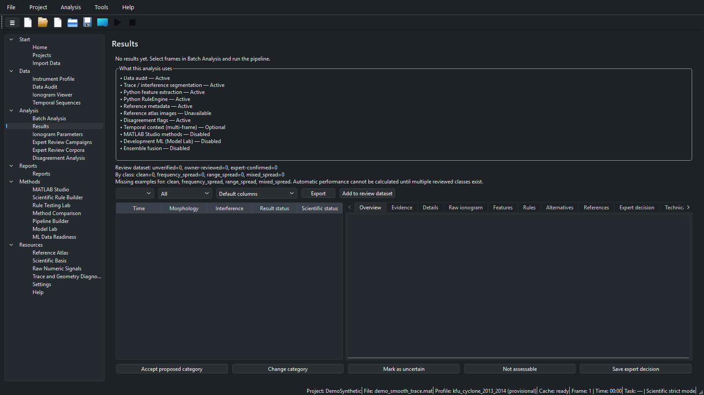

# Ionogram Morphology Lab

[English](README.md) | [Русский](README_RU.md) · **Release 1.1.1** · **Build Identity: ML-A.1a.2**

Ionogram Morphology Lab (IML) is a bilingual (EN/RU) desktop research application for **source-traceable ionogram morphology analysis**, expert review campaigns, disagreement analysis, dataset readiness audits, rule testing, and report export. It imports user-selected MATLAB (`.mat`) data, preserves provenance, and keeps morphology, ambiguity, quality, and parameter proposals on **separate scientific axes**.

> **Scientific status:** Output is a **candidate** morphology or parameter proposal compatible with image evidence. It does **not** establish a physical mechanism, replace expert scaling, or validate a model. Expert labels are human decisions, not ground truth. Development models and custom rules require independent, domain-appropriate validation before operational use. **ML Data Readiness** is a descriptive audit only — it does **not** authorize model training.



*Home — recommended workflow with synthetic demo data (`DemoSynthetic` / `demo_smooth_trace.mat`). Captures under `docs/assets/screenshots/ml-a1a2/`.*

## Capabilities

- Local-first MAT import with inventory / data audit (source files are never rewritten)
- Ionogram viewer, temporal sequences, batch analysis, bilingual reports
- Python RuleEngine path by default (MATLAB Studio and Model Lab remain optional / non-default)
- Expert review corpora and campaigns with blind rounds, reveal/compare, and adjudication
- Disagreement analysis (descriptive; neither expert nor candidate is ground truth)
- **ML Data Readiness (ML-A.1a.2):** inventory, class coverage, sources/dates, contamination, holdout feasibility assessment, Readiness Gate A–F (F = ML-B planning only)
- EN/RU UI, Help, and documentation

## Module comparison

| Module | Purpose | Produces | Does **not** do |
|--------|---------|----------|-----------------|
| Import / Audit / Profile | Register MAT, inventory, instrument axes | Inventory / audit artifacts | Morphology classification |
| Viewer / Sequences | Inspect frames and time context | Display / contact sheets | Expert labels or training sets |
| Batch / Results | Default Python candidate pipeline | Candidate predictions + run provenance | Confirmed science / URSI scaling |
| Expert Review Corpora | Blind human reviews on frozen cohorts | Locked reviews, reveal/compare | Ground truth; training authorization |
| Expert Review Campaigns | Multi-date/source campaign operations | Campaign manifests / progress | Scientific validation claims |
| Disagreement Analysis | Describe expert↔candidate / expert↔expert patterns | Frozen descriptive snapshot + gate | Accuracy/F1; declare a winner |
| ML Data Readiness | Dataset/label readiness for a task contract | Frozen readiness audit + exports | Model training; final holdout manifests |
| MATLAB Studio / Model Lab | Optional method / research prototyping | Studio or model-lab artifacts | Default automatic analysis |
| Rule Builder / Testing | Author and test versioned rule packs | Packs / test reports | External validation by itself |

## End-to-end user workflow

1. **Install or unpack** a writable workspace outside the install folder; choose EN or RU.
2. **Create or open a project** (Projects). Prefer `synthetic_data/` for first runs.
3. **Import MAT** without rewriting source; confirm **Instrument Profile**; run **Data Audit**.
4. **View** frames; optionally build temporal sequences.
5. **Run Batch Analysis** (default Python path); inspect **Results** as candidates only.
6. Build an **expert review corpus**, complete **blind** rounds, then reveal/compare (campaigns when operating across many sources/dates).
7. Optionally run **Disagreement Analysis** on revealed corpora (descriptive only).
8. Run **ML Data Readiness** for a chosen task contract; freeze an audit; read the Gate. Outcome **F** means ML-B *planning* only — still **no training**.
9. Export bilingual reports / readiness exports as needed. Keep research MAT and runtime audits out of git.

## Featured screenshots (ML-A.1a.2)

PNG captures at 1600×900 from the ML-A.1a.2 UI with synthetic/demo labels only. No owner private paths or credentials. Each scene has an EN and RU twin under `docs/assets/screenshots/ml-a1a2/`.

<details>
<summary><strong>Home</strong></summary>


*Home — entry dashboard and recommended workflow. RU: `home_ru.png`.*

</details>

<details>
<summary><strong>Ionogram Viewer</strong></summary>



*Ionogram Viewer — inspect frames before/after analysis. RU: `ionogram_viewer_ru.png`.*

</details>

<details>
<summary><strong>Expert Review Campaigns</strong></summary>



*Campaigns — multi-source/date pilot operations. RU: `campaigns_ru.png`.*

</details>

<details>
<summary><strong>Expert Review Corpora</strong></summary>



*Corpora — blind review, reveal/compare entry. RU: `expert_review_ru.png`.*

</details>

<details>
<summary><strong>Disagreement Analysis</strong></summary>



*Disagreement Analysis — descriptive snapshot only. RU: `disagreement_analysis_ru.png`.*

</details>

<details>
<summary><strong>ML Data Readiness</strong></summary>



*ML Data Readiness — audit selection/freeze (example pilot title). RU: `ml_data_readiness_ru.png`.*

</details>

<details>
<summary><strong>Results</strong></summary>



*Results — automatic candidates are not expert-confirmed. RU: `results_ru.png`.*

</details>

Additional historical page captures remain under [`docs/assets/screenshots/v1.1.1/`](docs/assets/screenshots/v1.1.1/) (still referenced by some secondary docs).

## Quick start

See [User Guide (EN)](docs/USER_GUIDE_EN.md), [Installation](docs/INSTALLATION_EN.md). Portable: unpack, keep files together, use a writable workspace outside the install folder.

```bash
python -m venv .venv
.venv\Scripts\activate
pip install -e ".[dev]"
python -m ionogram_morphology_lab.app.main
```

Packaged EXE (when distributed): run `IonogramMorphologyLab.exe` from the portable folder. Accepted Build Identity for this readiness phase: **ML-A.1a.2**.

1. Choose language · 2. New Project · 3. Start with `synthetic_data/` · 4. Follow Home recommended steps.

## Projects and MAT data

- Projects store metadata, caches, runs, review corpora/campaigns, and readiness audits under the project tree.
- Import registers a user-selected `.mat` path; IML does not rewrite `Amp_all` or other source arrays.
- Prefer synthetic teaching files under `synthetic_data/` for demos and documentation.
- Keep owner research MAT, local databases, and generated review/readiness exports out of version control.

## Expert corpora, campaigns, and blind review

- **Expert Review Corpora** hold frozen cohorts, blind reviews, reveal/compare outcomes, and optional adjudication.
- **Expert Review Campaigns** organize multi-source / multi-date pilot operations without claiming scientific validation.
- Blind rounds must complete before reveal; candidate labels must not leak into blind views.
- Corrected reviews are revisions with provenance — not independent second opinions unless a distinct reviewer/round is recorded.

## Disagreement analysis

Read-only descriptive layer above revealed corpora/campaigns (`iml-disagreement-analysis-0.1.0`). It summarizes transitions and strata and records an analyst decision gate. It does **not** treat expert or candidate as ground truth and does not produce accuracy metrics.


*Disagreement Analysis — selection/freeze tab; synthetic cohort `demo_pilot_example`.*

## ML Data Readiness (ML-A.1a.2)

Protocol: `iml-ml-dataset-readiness-0.1.0`. Shadow-only audit and governance:

- Inventory of expert-labelled items for a task contract (A–D family)
- Class coverage, missingness, reviewer independence
- Contamination checks (development-exposed items, related-frame groups, sequences)
- Holdout **feasibility assessment** (not a final holdout dataset)
- Readiness Gate outcomes A–F; **F authorizes ML-B manifest planning only**
- Always: `authorizes_training=False`; no accuracy/F1/sensitivity/specificity claims


*ML Data Readiness — Selection and Freeze. Caption on page states audit limits.*

### Pilot example (labelled example only)

The screenshots show a **synthetic teaching example** titled `Demo pilot readiness (example)` on cohort `demo_pilot_example`. It is **not** a scientific claim about any research corpus. A small concentrated pilot with limited dates/sources and few independent second reviews typically lands on Gate outcomes such as A, C, D, or E — that is an expected readiness result, not a software failure.

## Integrity and contamination posture

- Candidate labels are excluded from expert target distributions used for readiness coverage.
- Development-exposed disagreement items cannot enter an untouched holdout assessment as clean.
- Related-frame groups / sequences are not treated as randomly splittable units.
- Frozen audits are immutable; corrected revisions get a new audit identity and preserve the parent.
- Acquisition dates use documented authority order; frame clock times are not treated as source dates.
- Exports strip absolute owner paths where the readiness/disagreement contracts require it.

## Installation and launch (verified paths)

| Path | Notes |
|------|--------|
| Dev: `pip install -e ".[dev]"` then `python -m ionogram_morphology_lab.app.main` | Verified for contributors |
| Portable packaged EXE | Unpack folder; run EXE; writable workspace outside install dir |
| MATLAB | Optional; not required for default Python analysis |

## Development and verification

Common checks (from a clean env with project deps):

```bash
python -m pytest
python scripts/validate_feature_registry_v2.py
python scripts/validate_synthetic_geometry_v2.py
python scripts/validate_ml_dataset_readiness.py
python scripts/validate_morphology_disagreement_analysis.py
python scripts/validate_i18n.py
python scripts/validate_docs.py
python scripts/check_repository_hygiene.py
```

Release-gate evidence for ML-A.1a.2 (already completed): **769** pytest passed; validators + hygiene OK; owner visual QA PASS; accepted EXE SHA-256 `67FBB83E6BCECF2A58C719A57AF5E60B9E74FCB31EB1FC130B8BD8DAE6A6A246`. See [`docs/MLA1_FINAL_RELEASE_GATE_REPORT.md`](docs/MLA1_FINAL_RELEASE_GATE_REPORT.md).

## Repository structure (high level)

| Path | Role |
|------|------|
| `src/ionogram_morphology_lab/` | Application package (UI, analysis, readiness, review) |
| `scripts/` | Validators and maintenance utilities |
| `tests/` | Pytest suite |
| `docs/` | Guides, acceptance reports, screenshot assets |
| `synthetic_data/` | Teaching MAT files |
| `rule_packs/` | Versioned scientific rule packs |
| `dist/` | Local packaged builds (not committed) |

## Runtime and git safety

Do **not** commit: owner MAT files, `review_dataset/` runtime data, readiness/disagreement exports, local workspaces, caches, `build/`, `dist/`, personal settings, credentials. Prefer the inclusion lists in phase acceptance / final gate reports.

## Troubleshooting

| Symptom | What to check |
|---------|----------------|
| Viewer empty | Project + MAT + profile; rebuild cache after audit |
| Batch did not use MATLAB/ML | Default path is Python RuleEngine — expected |
| Blind reveal blocked | Complete required blind round first |
| Readiness Gate not F / not training | Training is never authorized; F is planning-only |
| Progress stuck after freeze | ML-A.1a.2 requires success at 100% with Cancel disabled — update to this build |
| Paths look absolute in exports | Use contract export actions; keep research data out of git |

## Roadmap

- **Done (this phase):** ML-A.1 → ML-A.1a.2 dataset readiness (shadow-only).
- **Not started:** **ML-B** (train/development/holdout manifests and any training workflow).
- MATLAB Studio / Model Lab remain optional research surfaces, not default analysis.

## Documentation map

| Document | Role |
|----------|------|
| [USER_GUIDE_EN.md](docs/USER_GUIDE_EN.md) | Complete control reference |
| [USER_GUIDE_RU.md](docs/USER_GUIDE_RU.md) | Полный справочник элементов |
| [SCIENTIFIC_DECISION_MAP.md](docs/SCIENTIFIC_DECISION_MAP.md) | Default analysis path |
| [MLA1_FINAL_RELEASE_GATE_REPORT.md](docs/MLA1_FINAL_RELEASE_GATE_REPORT.md) | ML-A.1a.2 release gate |
| [MLA1_README_SCREENSHOT_REFRESH_REPORT.md](docs/MLA1_README_SCREENSHOT_REFRESH_REPORT.md) | This README/screenshot refresh |

## License / citation

See repository `LICENSE` and science claim packs. Cite IML version **1.1.1** with Build Identity **ML-A.1a.2** and the analysis run id from Reports when reproducing a run.
