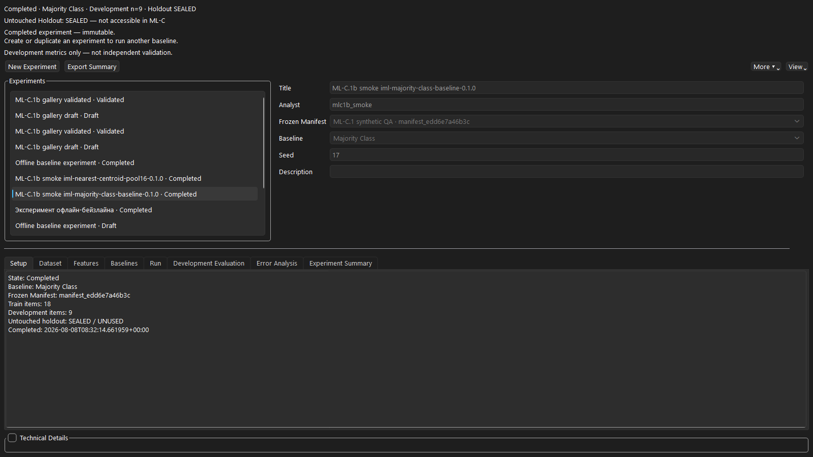
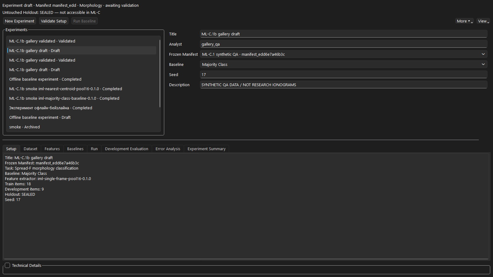
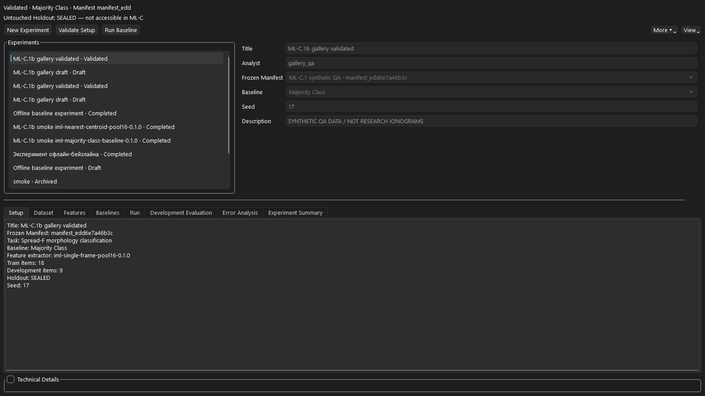
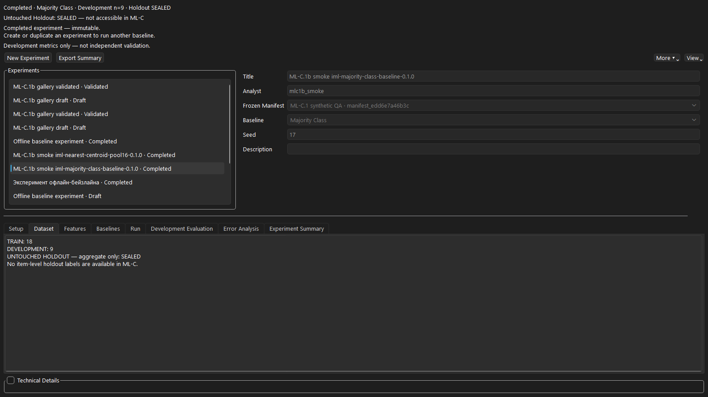
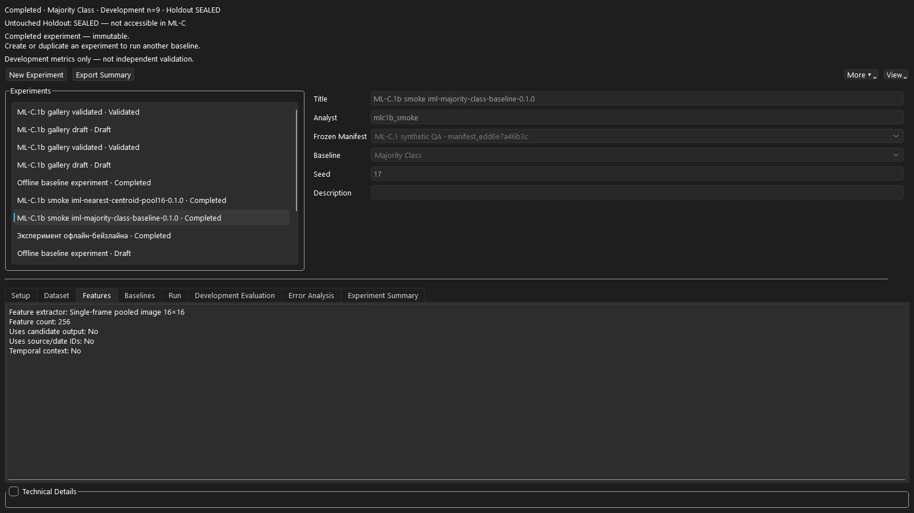
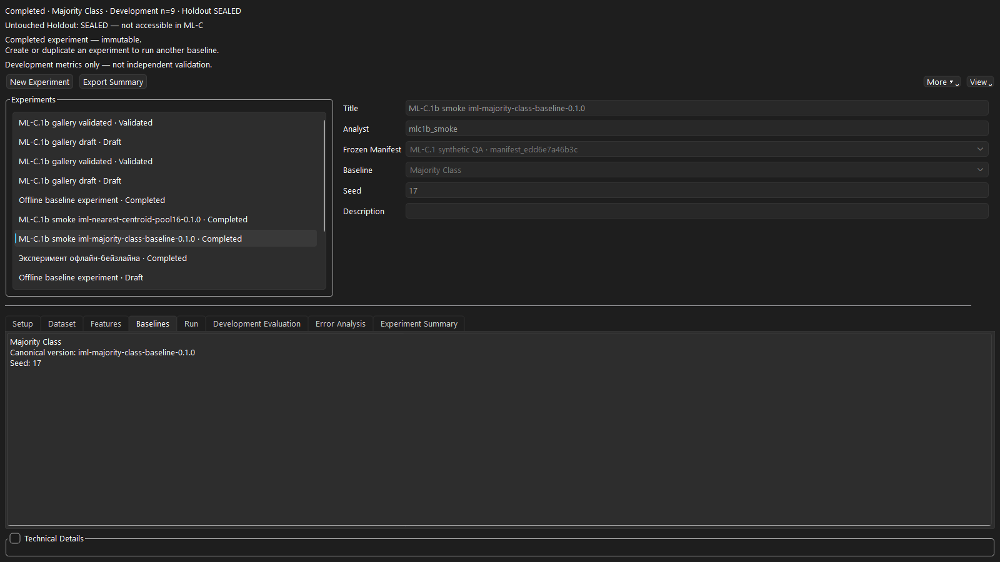
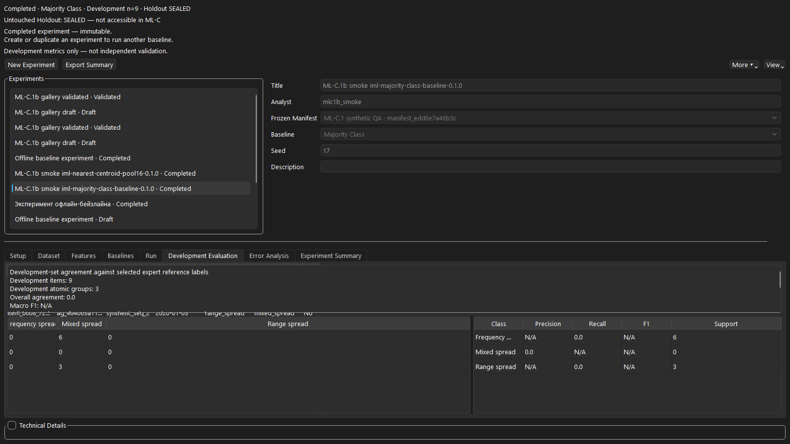
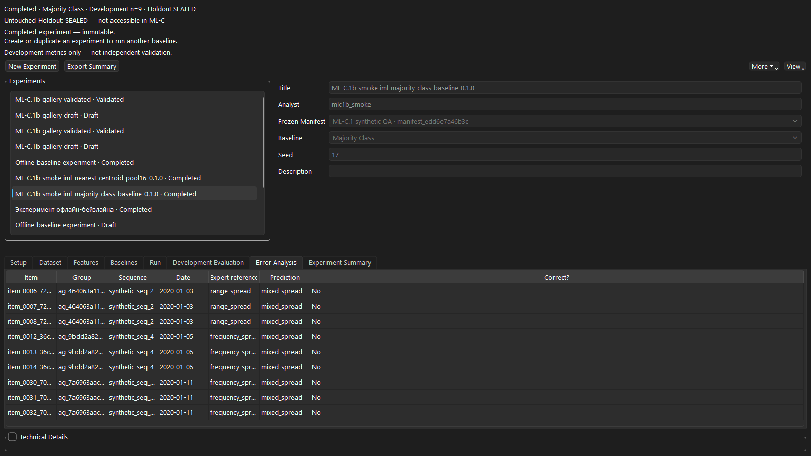
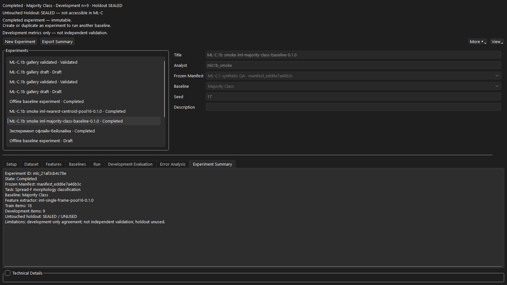

# Ionogram Morphology Lab

[English](README.md) | [Русский](README_RU.md) · **Release 1.1.1** · **Build Identity: ML-C.1b**

Ionogram Morphology Lab (IML) is a bilingual (EN/RU) desktop research application for **source-traceable ionogram morphology analysis**, expert review campaigns, disagreement analysis, dataset readiness audits, leakage-safe dataset manifests, rule testing, and report export. It imports user-selected MATLAB (`.mat`) data, preserves provenance, and keeps morphology, ambiguity, quality, and parameter proposals on **separate scientific axes**.

> **Scientific status:** Output is a **candidate** morphology or parameter proposal compatible with image evidence. It does **not** establish a physical mechanism, replace expert scaling, or validate a model. Expert labels are human decisions, not ground truth. Development models and custom rules require independent, domain-appropriate validation before operational use. **ML Data Readiness** and **ML Dataset Manifests** are planning/governance surfaces only — they do **not** authorize model training. **ML-C.1b** adds offline experimental baselines (TRAIN fit / DEVELOPMENT evaluation only; untouched holdout remains SEALED / UNUSED). Development metrics are **not** independent validation. **ML-D** and **ML-E** are not started. Production RuleEngine remains unwired to ML-C.



*Offline ML Baselines — completed Majority Class on synthetic QA (Development n=9; holdout SEALED). Gallery: `docs/assets/screenshots/ml-c1b/`.*

## Capabilities

- Local-first MAT import with inventory / data audit (source files are never rewritten)
- Ionogram viewer, temporal sequences, batch analysis, bilingual reports
- Python RuleEngine path by default (MATLAB Studio and Model Lab remain optional / non-default)
- Expert review corpora and campaigns with blind rounds, reveal/compare, and adjudication
- Disagreement analysis (descriptive; neither expert nor candidate is ground truth)
- **ML Data Readiness (ML-A.1a.2):** inventory, class coverage, sources/dates, contamination, holdout feasibility assessment, Readiness Gate A–F (F = ML-B planning only)
- **ML Dataset Manifests (ML-B.1d):** immutable role manifests, leakage-safe atomic groups, train / development / untouched-holdout reservation (workflow-sealed labels).
- **Offline ML Baselines (ML-C.1 / ML-C.1b):** experimental TRAIN-fit / DEVELOPMENT-eval baselines; holdout sealed; not independent validation / not production RuleEngine.
- EN/RU UI, Help, and documentation

## Module comparison

| Module | Purpose | Produces | Does **not** do |
|--------|---------|----------|-----------------|
| Import / Audit / Profile | Register MAT, inventory, instrument axes | Inventory / audit artifacts | Morphology classification |
| Viewer / Sequences | Inspect frames and time context | Display / contact sheets | Expert labels or training sets |
| Batch / Results | Default Python candidate pipeline | Candidate predictions + run provenance | Confirmed science / URSI scaling |
| Expert Review Corpora | Blind human reviews on frozen cohorts | Locked reviews, reveal/compare | Ground truth; training authorization |
| Expert Review Campaigns | Multi-date/source campaign operations | Campaign manifests / progress | Scientific validation claims |
| Disagreement Analysis | Describe expert↔candidate / expert↔expert patterns | Frozen descriptive snapshot + gate | Accuracy/F1; declare a winner |
| ML Data Readiness | Dataset/label readiness for a task contract | Frozen readiness audit + exports | Model training; final holdout manifests |
| ML Dataset Manifests | Leakage-safe train/dev/holdout identity reservation | Frozen manifest set + public exports | Model training; holdout unlock |
| Offline ML Baselines (ML-C.1b) | Experimental TRAIN-fit / DEVELOPMENT-eval baselines above frozen ML-B manifests | Development metrics + immutable experiment artifacts | Holdout evaluation; independent validation; production RuleEngine wiring; ML-D/E |
| MATLAB Studio / Model Lab | Optional method / research prototyping | Studio or model-lab artifacts | Default automatic analysis |
| Rule Builder / Testing | Author and test versioned rule packs | Packs / test reports | External validation by itself |

## End-to-end user workflow

1. **Install or unpack** a writable workspace outside the install folder; choose EN or RU.
2. **Create or open a project** (Projects). Prefer `synthetic_data/` for first runs.
3. **Import MAT** without rewriting source; confirm **Instrument Profile**; run **Data Audit**.
4. **View** frames; optionally build temporal sequences.
5. **Run Batch Analysis** (default Python path); inspect **Results** as candidates only.
6. Build an **expert review corpus**, complete **blind** rounds, then reveal/compare (campaigns when operating across many sources/dates).
7. Optionally run **Disagreement Analysis** on revealed corpora (descriptive only).
8. Run **ML Data Readiness** for a chosen task contract; freeze an audit; read the Gate. Outcome **F** means ML-B *planning* only — still **no training**.
9. When Gate F permits, open **ML Dataset Manifests**, build atomic groups, reserve roles, freeze a manifest set (holdout labels remain sealed).
10. Optionally open **Offline ML Baselines (ML-C.1b)** on a frozen manifest: fit on TRAIN only, evaluate on DEVELOPMENT only; untouched holdout stays SEALED / UNUSED. Development metrics are not independent validation.
11. Export bilingual reports / readiness / public manifest / baseline summaries as needed. Keep research MAT and runtime audits out of git.

## Featured screenshots (ML-C.1b)

PNG captures at 1600×900 from the **ML-C.1b** Offline ML Baselines UI on synthetic QA only (`MLC1_Offline_Baselines_QA_*`). No owner private paths, absolute runtime artifact paths, or credentials. Each scene has an EN and RU twin under `docs/assets/screenshots/ml-c1b/`. Historical malformed `m` experiments are not shown.

<details>
<summary><strong>Offline ML Baselines — overview / Setup</strong></summary>


*Completed Majority Class — Development n=9; holdout SEALED; Technical Details collapsed. RU: `baselines_overview_ru.png`.*

</details>

<details>
<summary><strong>Draft — Validate visible, Run disabled</strong></summary>



*New draft lifecycle. RU: `draft_validate_disabled_run_ru.png`.*

</details>

<details>
<summary><strong>Validated — Run enabled</strong></summary>



*After Validate Setup. RU: `validated_enabled_run_ru.png`.*

</details>

<details>
<summary><strong>Dataset / holdout SEALED</strong></summary>



*TRAIN / DEVELOPMENT / SEALED holdout aggregates. RU: `dataset_holdout_sealed_ru.png`.*

</details>

<details>
<summary><strong>Features</strong></summary>



*Candidate-independent pool16 (256). RU: `features_ru.png`.*

</details>

<details>
<summary><strong>Baselines</strong></summary>



*Majority / Nearest Centroid / Logistic options. RU: `baselines_ru.png`.*

</details>

<details>
<summary><strong>Development Evaluation</strong></summary>



*Development-only agreement; Macro F1 N/A when undefined; full morphology class labels. RU: `development_evaluation_ru.png`.*

</details>

<details>
<summary><strong>Error Analysis</strong></summary>



*Item / Group / Expert reference / Date / Prediction / Correct? — DEVELOPMENT only. RU: `error_analysis_ru.png`.*

</details>

<details>
<summary><strong>Completed Experiment Summary</strong></summary>



*Immutable completed summary; holdout unused. RU: `completed_summary_ru.png`.*

</details>

<details>
<summary><strong>View / More menus</strong></summary>


*Localized View / More controls. Twins: `view_menu_ru.png`, `more_menu_en.png`, `more_menu_ru.png`.*

</details>

Prior manifests gallery: [`docs/assets/screenshots/ml-b1d/`](docs/assets/screenshots/ml-b1d/) (not overwritten). Readiness / home tour: [`docs/assets/screenshots/ml-a1a2/`](docs/assets/screenshots/ml-a1a2/). Older pages: [`docs/assets/screenshots/v1.1.1/`](docs/assets/screenshots/v1.1.1/).

## Quick start

See [User Guide (EN)](docs/USER_GUIDE_EN.md), [Installation](docs/INSTALLATION_EN.md). Portable: unpack, keep files together, use a writable workspace outside the install folder.

```bash
python -m venv .venv
.venv\Scripts\activate
pip install -e ".[dev]"
python -m ionogram_morphology_lab.app.main
```

Packaged EXE (when distributed): run `IonogramMorphologyLab.exe` from the portable folder. Current Build Identity: **ML-C.1b**.

1. Choose language · 2. New Project · 3. Start with `synthetic_data/` · 4. Follow Home recommended steps.

## Projects and MAT data

<details>
<summary><strong>Projects</strong></summary>

- **Purpose:** Create, open, and switch analysis projects safely.
- **When to use:** Before importing MAT data, or when changing workspace context.
- **Prerequisites:** Writable workspace path for create; existing project path for open.
- **Controls:** Current project card (name, path, created, last opened, active source, active run, unsaved changes); Open Project; Choose Project Folder; Open Recent Project; Remove from recent list; Create Project.
- **Effect:** Loads or creates project metadata; before switching — stops/resolves active jobs, warns about unsaved edits, clears stale UI state so results from two projects are never mixed.
- **Output:** Project directory and database rows; recent-projects list in settings.
- **Common mistake:** Creating inside the portable EXE folder; ignoring unsaved-change or active-job warnings.
- **Scientific limitation:** Project creation does not validate science.

</details>

- Projects store metadata, caches, runs, review corpora/campaigns, and readiness audits under the project tree.
- Import registers a user-selected `.mat` path; IML does not rewrite `Amp_all` or other source arrays.
- Prefer synthetic teaching files under `synthetic_data/` for demos and documentation.
- Keep owner research MAT, local databases, and generated review/readiness exports out of version control.

## Expert corpora, campaigns, and blind review

- **Expert Review Corpora** hold frozen cohorts, blind reviews, reveal/compare outcomes, and optional adjudication.
- **Expert Review Campaigns** organize multi-source / multi-date pilot operations without claiming scientific validation.
- Blind rounds must complete before reveal; candidate labels must not leak into blind views.
- Corrected reviews are revisions with provenance — not independent second opinions unless a distinct reviewer/round is recorded.

## Disagreement analysis

Read-only descriptive layer above revealed corpora/campaigns (`iml-disagreement-analysis-0.1.0`). It summarizes transitions and strata and records an analyst decision gate. It does **not** treat expert or candidate as ground truth and does not produce accuracy metrics.


*Disagreement Analysis — selection/freeze tab; synthetic cohort `demo_pilot_example`.*

## ML Data Readiness (ML-A.1a.2)

Protocol: `iml-ml-dataset-readiness-0.1.0`. Shadow-only audit and governance:

- Inventory of expert-labelled items for a task contract (A–D family)
- Class coverage, missingness, reviewer independence
- Contamination checks (development-exposed items, related-frame groups, sequences)
- Holdout **feasibility assessment** (not a final holdout dataset)
- Readiness Gate outcomes A–F; **F authorizes ML-B manifest planning only**
- Always: `authorizes_training=False`; no accuracy/F1/sensitivity/specificity claims


*ML Data Readiness — Selection and Freeze. Caption on page states audit limits.*

## ML Dataset Manifests (ML-B.1d)

Protocol: `iml-ml-dataset-manifests-0.1.0`. Shadow-only planning above a frozen readiness audit:

- Deterministic leakage graph → **atomic groups** that must never split across dataset roles
- Roles: **train**, **development**, **untouched holdout**, excluded (identity reservation only — not training)
- Final freeze only when readiness Gate is **F** (planning-only); non-F audits allow draft simulation and correctly block freeze
- Public holdout identity manifest without item-level targets; reference labels are **workflow-sealed** (not cryptographic secrecy); ML-B cannot unlock them
- Always: `authorizes_training=False`; holdout remains sealed; no accuracy/F1 claims. Offline baselines are a separate ML-C.1b surface.

### Scenario A — scientifically blocked pilot (example)

A one-sequence, fully development-exposed pilot (acquisition date `2014-10-15`) correctly yields **no untouched holdout groups** and **blocks freeze**. That is expected science, not a software failure.

### Scenario B — synthetic Gate F (teaching example only)

README screenshots use a **sanitized synthetic Gate-F teaching example** (multi-sequence, multi-date). Illustrative frozen counts: train 4 items / 4 groups; development 2 / 2; untouched holdout 3 / 2; Integrity PASS. It is **not** a scientific claim about any research corpus and does **not** authorize training.

## Integrity and contamination posture

- Candidate labels are excluded from expert target distributions used for readiness coverage.
- Development-exposed disagreement items cannot enter an untouched holdout assessment as clean.
- Related-frame groups / sequences are not treated as randomly splittable units.
- Frozen audits are immutable; corrected revisions get a new audit identity and preserve the parent.
- Acquisition dates use documented authority order; frame clock times are not treated as source dates.
- Exports strip absolute owner paths where the readiness/disagreement contracts require it.

## Installation and launch (verified paths)

| Path | Notes |
|------|--------|
| Dev: `pip install -e ".[dev]"` then `python -m ionogram_morphology_lab.app.main` | Verified for contributors |
| Portable packaged EXE | Unpack folder; run EXE; writable workspace outside install dir |
| MATLAB | Optional; not required for default Python analysis |

## Development and verification

Common checks (from a clean env with project deps):

```bash
python -m pytest
python scripts/validate_feature_registry_v2.py
python scripts/validate_synthetic_geometry_v2.py
python scripts/validate_ml_dataset_readiness.py
python scripts/validate_ml_dataset_manifests.py
python scripts/validate_morphology_disagreement_analysis.py
python scripts/validate_i18n.py
python scripts/validate_docs.py
python scripts/check_repository_hygiene.py
```

Release-gate evidence for **ML-C.1b**: **890** pytest passed; all release validators + hygiene OK; owner visual QA PASS; accepted EXE SHA-256 `1BA1E89E7B51C32992D7C3D00B807D4854EE2135DF5F25729CBA6322BDC3C484`. See [`docs/MLC1_FINAL_RELEASE_GATE_REPORT.md`](docs/MLC1_FINAL_RELEASE_GATE_REPORT.md). Prior ML-B.1d gate: [`docs/MLB1_FINAL_RELEASE_GATE_REPORT.md`](docs/MLB1_FINAL_RELEASE_GATE_REPORT.md).

## Repository structure (high level)

| Path | Role |
|------|------|
| `src/ionogram_morphology_lab/` | Application package (UI, analysis, readiness, review) |
| `scripts/` | Validators and maintenance utilities |
| `tests/` | Pytest suite |
| `docs/` | Guides, acceptance reports, screenshot assets |
| `synthetic_data/` | Teaching MAT files |
| `rule_packs/` | Versioned scientific rule packs |
| `dist/` | Local packaged builds (not committed) |

## Runtime and git safety

Do **not** commit: owner MAT files, `review_dataset/` runtime data, readiness/disagreement exports, local workspaces, caches, `build/`, `dist/`, personal settings, credentials. Prefer the inclusion lists in phase acceptance / final gate reports.

## Troubleshooting

| Symptom | What to check |
|---------|----------------|
| Viewer empty | Project + MAT + profile; rebuild cache after audit |
| Batch did not use MATLAB/ML | Default path is Python RuleEngine — expected |
| Blind reveal blocked | Complete required blind round first |
| Readiness Gate not F / not training | Training is never authorized; F is planning-only |
| Progress stuck after freeze | ML-A.1a.2 requires success at 100% with Cancel disabled — update to this build |
| Paths look absolute in exports | Use contract export actions; keep research data out of git |

## Roadmap

- **Done:** ML-A.1 → ML-A.1a.2 dataset readiness (shadow-only).
- **Done:** **ML-B.1 → ML-B.1d** immutable dataset manifests and leakage-safe role reservation (shadow-only; no training).
- **Released (this gate):** **ML-C.1 → ML-C.1b** offline experimental baselines — TRAIN fit / DEVELOPMENT evaluation; holdout SEALED / UNUSED; development metrics are not independent validation.
- **Not started:** **ML-D / ML-E**.
- MATLAB Studio / Model Lab remain optional research surfaces, not default analysis.

## Documentation map

| Document | Role |
|----------|------|
| [USER_GUIDE_EN.md](docs/USER_GUIDE_EN.md) | Complete control reference |
| [USER_GUIDE_EN.md](docs/USER_GUIDE_EN.md) | Full control reference |
| [SCIENTIFIC_DECISION_MAP.md](docs/SCIENTIFIC_DECISION_MAP.md) | Default analysis path |
| [MLB1_FINAL_RELEASE_GATE_REPORT.md](docs/MLB1_FINAL_RELEASE_GATE_REPORT.md) | ML-B.1d release gate |
| [MLA1_FINAL_RELEASE_GATE_REPORT.md](docs/MLA1_FINAL_RELEASE_GATE_REPORT.md) | Prior ML-A.1a.2 release gate |
| [MLC1_ACCEPTANCE_REPORT.md](docs/MLC1_ACCEPTANCE_REPORT.md) | ML-C.1 acceptance |
| [MLC1A_ACCEPTANCE_REPORT.md](docs/MLC1A_ACCEPTANCE_REPORT.md) | ML-C.1a acceptance |
| [MLC1B_ACCEPTANCE_REPORT.md](docs/MLC1B_ACCEPTANCE_REPORT.md) | ML-C.1b acceptance |
| [MLC1_OWNER_QA.md](docs/MLC1_OWNER_QA.md) | ML-C.1 / ML-C.1b owner QA checklist |
| [MLC1_FINAL_RELEASE_GATE_REPORT.md](docs/MLC1_FINAL_RELEASE_GATE_REPORT.md) | ML-C.1b final release gate |

## License / citation

See repository `LICENSE` and science claim packs. Cite IML version **1.1.1** with Build Identity **ML-C.1b** and the analysis run id from Reports when reproducing a run.
