# Ionogram Morphology Lab

[English](README.md) | [Русский](README_RU.md) · **Release 1.1.1**

Ionogram Morphology Lab (IML) is a bilingual (EN/RU) desktop research application for **source-traceable ionogram morphology analysis**, expert review, rule testing, and report export. It imports user-selected MATLAB (`.mat`) data, preserves provenance, and keeps morphology, ambiguity, quality, and parameter proposals on **separate scientific axes**.

> **Scientific status:** Output is a **candidate** morphology or parameter proposal compatible with image evidence. It does **not** establish a physical mechanism, replace expert scaling, or validate a model. Development models and custom rules require independent, domain-appropriate validation before operational use.

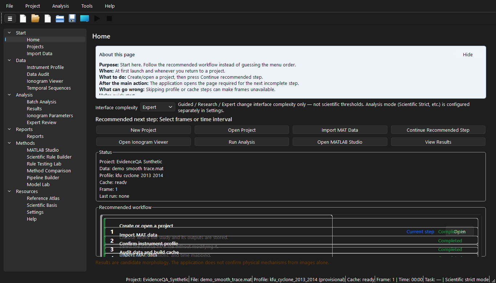

Teaching PNG captures use synthetic projects only under `docs/assets/screenshots/v1.1.1/`.

## Purpose

IML supports ionospheric radio-physics workflows where analysts must inspect frames with documented instrument context, record candidate morphology with uncertainty, apply versioned rules, and export bilingual reports without silently rewriting source data. Core analysis is **local-first** and does not require MATLAB.

## Default automatic analysis (v1.1.1)

Active: data audit · trace/interference segmentation · Python features · Python RuleEngine · reference **metadata** hints · disagreement flags.

Disabled / unavailable by default: MATLAB Studio methods · Model Lab models · ensemble fusion · pixel-to-pixel atlas image matching.

The Results page shows **What this analysis uses** so these boundaries stay visible.

## Installation & quick start

See [User Guide (EN)](docs/USER_GUIDE_EN.md), [Installation](docs/INSTALLATION_EN.md). Portable: unpack, keep files together, use a writable workspace outside the install folder.

```bash
python -m venv .venv
.venv\Scripts\activate
pip install -e ".[dev]"
python -m ionogram_morphology_lab.app.main
```

1. Choose language · 2. New Project · 3. Start with `synthetic_data/` · 4. Follow Home recommended steps.

## Visual tour (every page)

Screenshots are from the packaged UI with safe synthetic demonstration data. Personal paths and private MAT locations are excluded.

<details>
<summary><strong>Home</strong></summary>


- **Purpose:** Entry dashboard and recommended workflow.
- **When to use:** At first launch or when choosing the next safe step.
- **Prerequisites:** Writable project workspace.
- **Controls:** Continue recommended step; UX mode; New Project.
- **Effect:** Opens the next guided page or creates a project.
- **Output:** Project folder / navigation change.
- **Common mistake:** Skipping Import before Viewer.
- **Scientific limitation:** Does not analyse frames by itself.
- **Next step:** Projects or Import.

</details>


<details>
<summary><strong>Projects</strong></summary>

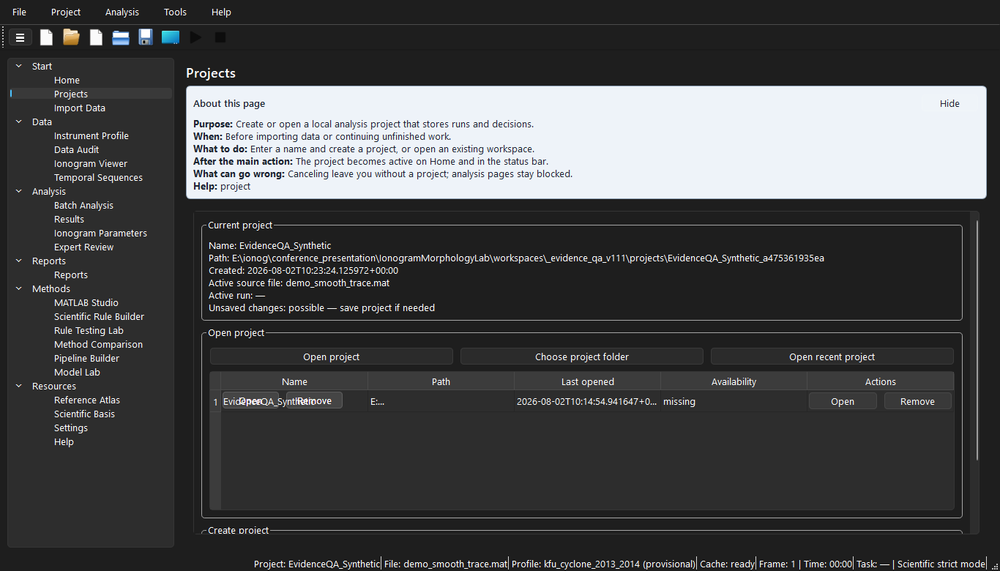

- **Purpose:** Create, open, and switch analysis projects safely.
- **When to use:** Before importing MAT data, or when changing workspace context.
- **Prerequisites:** Writable workspace path for create; existing project path for open.
- **Controls:** Current project card (name, path, created, last opened, active source, active run, unsaved changes); Open Project; Choose Project Folder; Open Recent Project; Remove from recent list; Create Project.
- **Effect:** Loads or creates project metadata; before switching — stops/resolves active jobs, warns about unsaved edits, clears stale UI state so results from two projects are never mixed.
- **Output:** Project directory and database rows; recent-projects list in settings.
- **Common mistake:** Creating inside the portable EXE folder; ignoring unsaved-change or active-job warnings.
- **Scientific limitation:** Project creation does not validate science.
- **Next step:** Import.

</details>


<details>
<summary><strong>Import</strong></summary>

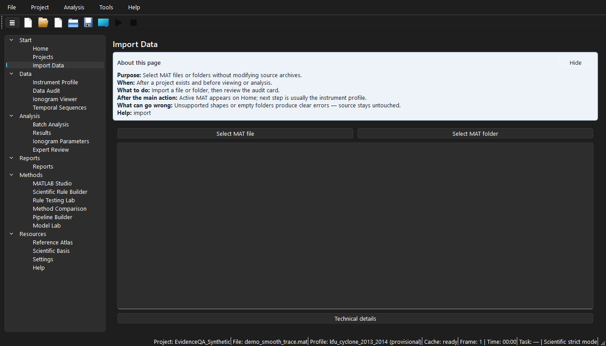

- **Purpose:** Select MAT file/folder without rewriting source.
- **When to use:** After a project exists.
- **Prerequisites:** Active project.
- **Controls:** Select file; Select folder; Technical details.
- **Effect:** Registers source path and inventory.
- **Output:** Inventory / audit artifacts only.
- **Common mistake:** Expecting IML to rewrite Amp_all.
- **Scientific limitation:** Import does not classify morphology.
- **Next step:** Data Audit / Profile.

</details>


<details>
<summary><strong>Profile</strong></summary>

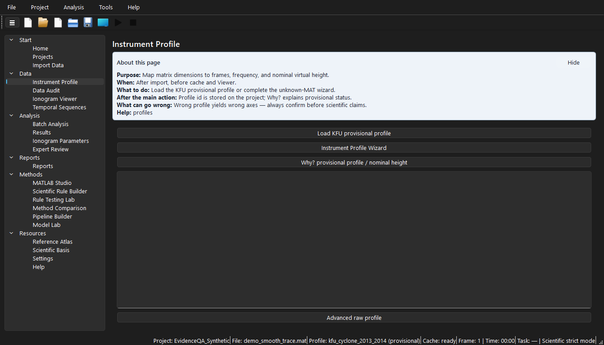

- **Purpose:** Instrument axes, time mapping, verification status.
- **When to use:** Before Viewer or Batch.
- **Prerequisites:** Imported MAT + chosen profile id.
- **Controls:** Profile selectors; provisional warnings.
- **Effect:** Loads axes labels and time mapping.
- **Output:** None to source MAT.
- **Common mistake:** Treating provisional axes as metrology.
- **Scientific limitation:** Nominal virtual height is not true height.
- **Next step:** Audit or Viewer.

</details>


<details>
<summary><strong>Audit</strong></summary>

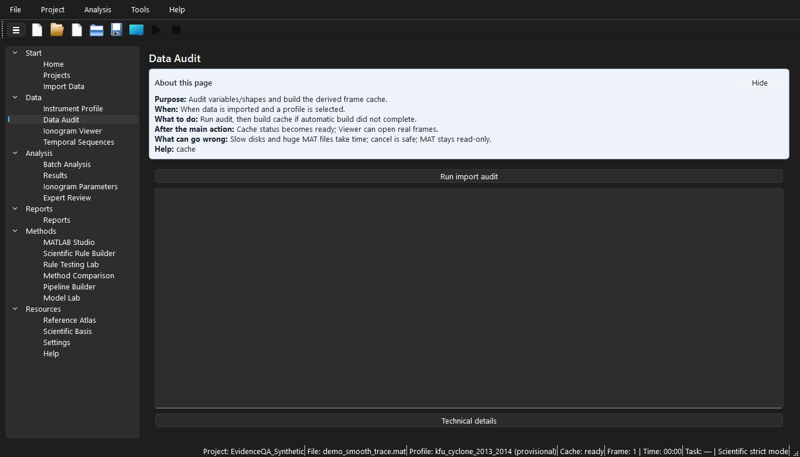

- **Purpose:** Quality and inventory checks for the active MAT.
- **When to use:** After Import, before trusting Batch.
- **Prerequisites:** Active MAT.
- **Controls:** Run audit / refresh cards.
- **Effect:** Shows variable shapes, warnings, readiness.
- **Output:** Audit report under project/workspace.
- **Common mistake:** Ignoring blocking quality warnings.
- **Scientific limitation:** Audit ≠ morphology classification.
- **Next step:** Viewer.

</details>


<details>
<summary><strong>Viewer</strong></summary>

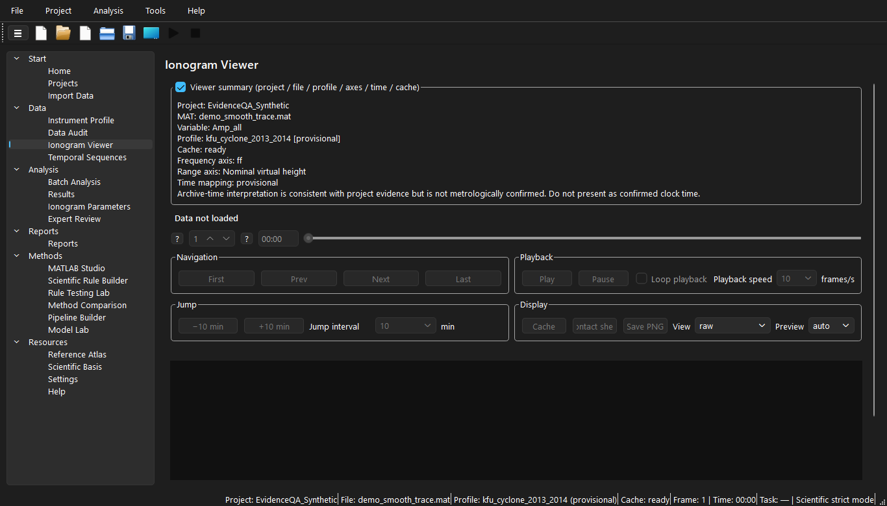

- **Purpose:** Inspect frames; collapsible summary; Navigation/Jump/Playback/Display.
- **When to use:** When inspecting evidence before/after analysis.
- **Prerequisites:** Imported MAT + profile + optional cache.
- **Controls:** First/Prev/Next/Last; ±N min; Play/Pause/Loop; Cache/Contact/Save; View/Preview.
- **Effect:** Renders current frame; builds derived cache on demand.
- **Output:** Derived cache / PNG exports only.
- **Common mistake:** Relying on fast preview as scientific proof.
- **Scientific limitation:** Display modes are diagnostic, not URSI scaling.
- **Next step:** Temporal Sequences or Batch.

</details>


<details>
<summary><strong>Temporal Sequences</strong></summary>

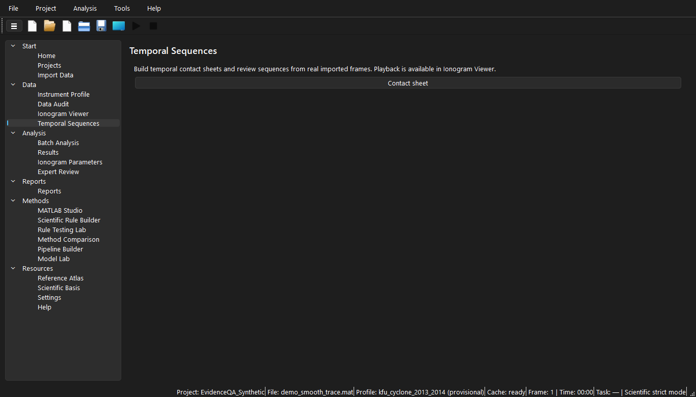

- **Purpose:** Build contact sheets / sequence views.
- **When to use:** When reviewing time evolution.
- **Prerequisites:** Ready Viewer cache preferred.
- **Controls:** Build contact sheet.
- **Effect:** Writes a contact-sheet image.
- **Output:** PNG under workspace/reports.
- **Common mistake:** Using contact sheet as sole morphology proof.
- **Scientific limitation:** Temporal context is optional for default analysis.
- **Next step:** Batch Analysis.

</details>


<details>
<summary><strong>Batch Analysis</strong></summary>

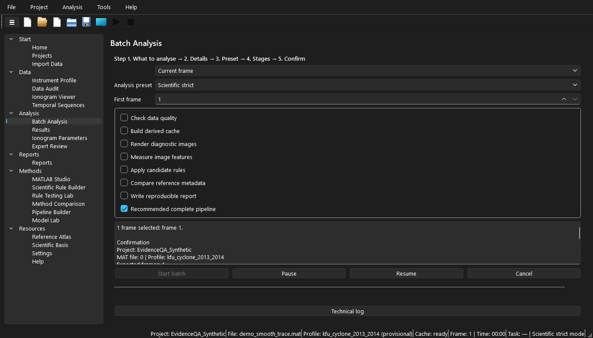

- **Purpose:** Select frames and run the default Python pipeline.
- **When to use:** When producing automatic candidates.
- **Prerequisites:** Project + MAT + profile.
- **Controls:** Mode/preset/stages; Start/Pause/Resume/Cancel; Technical log.
- **Effect:** Runs audit→features→RuleEngine→reports as selected.
- **Output:** Run root with predictions JSON.
- **Common mistake:** Assuming MATLAB/Model Lab ran automatically.
- **Scientific limitation:** Default path does not use MATLAB scripts or ML models.
- **Next step:** Results.

</details>


<details>
<summary><strong>Results</strong></summary>

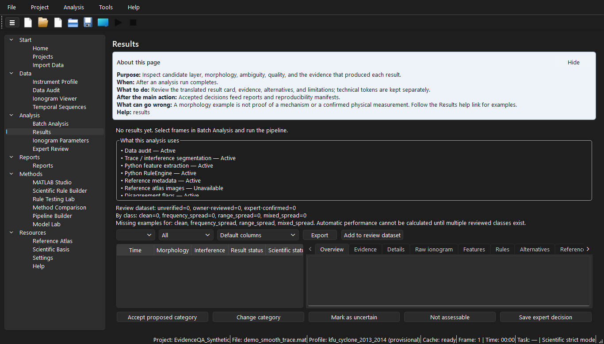

- **Purpose:** Compact table + details; pipeline panel; review dataset; diffuse why.
- **When to use:** After Batch completes.
- **Prerequisites:** last_run_root with predictions.
- **Controls:** Filter; columns; Export; Add to review dataset; Accept/Change/…
- **Effect:** Shows Automatic candidate status and evidence.
- **Output:** Exports / owner-review labels.
- **Common mistake:** Reading automatic as expert-confirmed.
- **Scientific limitation:** Candidates are not confirmed classifications.
- **Next step:** Expert Review or Reports.

</details>


<details>
<summary><strong>Parameters</strong></summary>

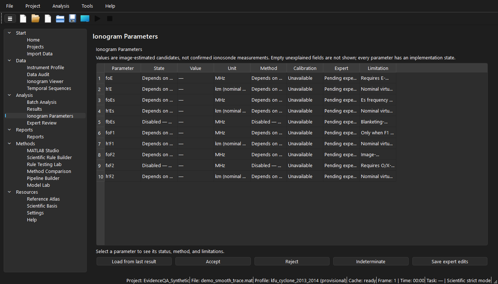

- **Purpose:** Documented parameter proposals / limits.
- **When to use:** When reviewing parameter-related claims.
- **Prerequisites:** Active project context.
- **Controls:** Parameter forms / save actions on page.
- **Effect:** Records provisional parameter proposals.
- **Output:** Config under project.
- **Common mistake:** Treating proposals as calibrated foF2.
- **Scientific limitation:** Not a substitute for expert scaling.
- **Next step:** Results / Reports.

</details>


<details>
<summary><strong>Expert Review</strong></summary>

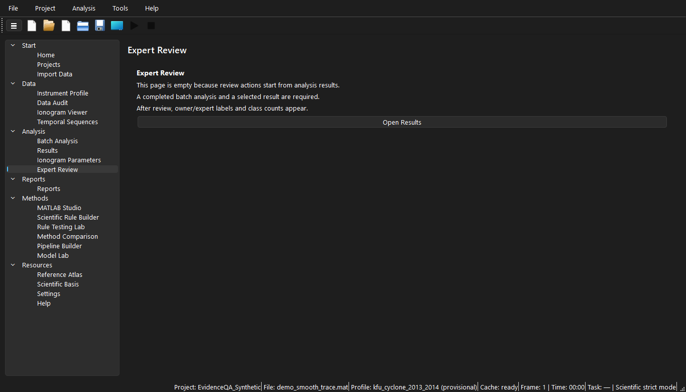

- **Purpose:** Guided entry to owner/expert decisions via Results.
- **When to use:** When human labels are needed.
- **Prerequisites:** Existing results row.
- **Controls:** Open Results; Add to review dataset (on Results).
- **Effect:** Navigates to Results review workflow.
- **Output:** Review-dataset JSON labels.
- **Common mistake:** Calling owner-reviewed expert-confirmed.
- **Scientific limitation:** Owner-reviewed ≠ expert-confirmed.
- **Next step:** Results.

</details>


<details>
<summary><strong>Reports</strong></summary>

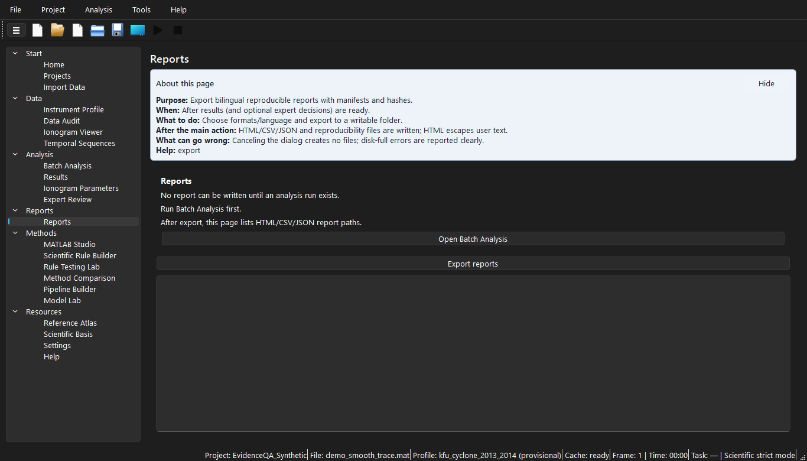

- **Purpose:** Export bilingual reproducible reports.
- **When to use:** After a run exists.
- **Prerequisites:** last_run_root.
- **Controls:** Export.
- **Effect:** Writes HTML/CSV/JSON/MD with provenance.
- **Output:** Report files under run/reports.
- **Common mistake:** Sharing without provenance review.
- **Scientific limitation:** Reports do not upgrade candidate status.
- **Next step:** Settings / archive.

</details>


<details>
<summary><strong>Reference Atlas</strong></summary>

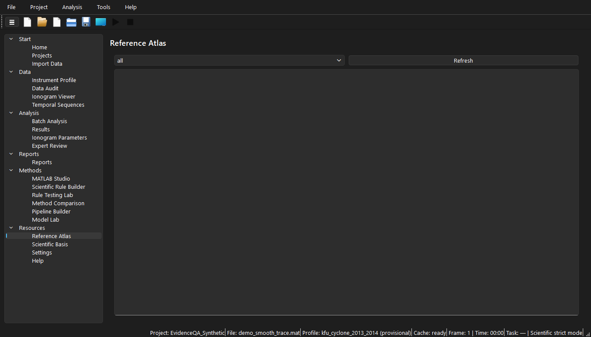

- **Purpose:** Metadata-linked reference wording (images may be unavailable).
- **When to use:** When comparing wording / citations.
- **Prerequisites:** Atlas pack installed.
- **Controls:** Filter; entry list; detail fields.
- **Effect:** Shows localized field labels; source titles preserved.
- **Output:** None to source MAT.
- **Common mistake:** Assuming pixel-to-pixel atlas matching.
- **Scientific limitation:** Default analysis uses metadata hints only.
- **Next step:** Scientific Basis.

</details>


<details>
<summary><strong>Scientific Basis</strong></summary>

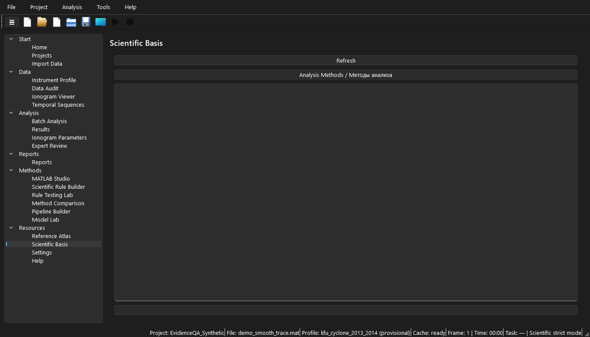

- **Purpose:** Claims, sources, limitations in EN/RU labels.
- **When to use:** When documenting scientific grounding.
- **Prerequisites:** Bundled science content.
- **Controls:** Section browser / technical pane.
- **Effect:** Displays translated labels; originals preserved.
- **Output:** None.
- **Common mistake:** Confusing claim text with automatic validation.
- **Scientific limitation:** Does not change RuleEngine thresholds.
- **Next step:** Rule Builder / Help.

</details>


<details>
<summary><strong>MATLAB Studio</strong></summary>

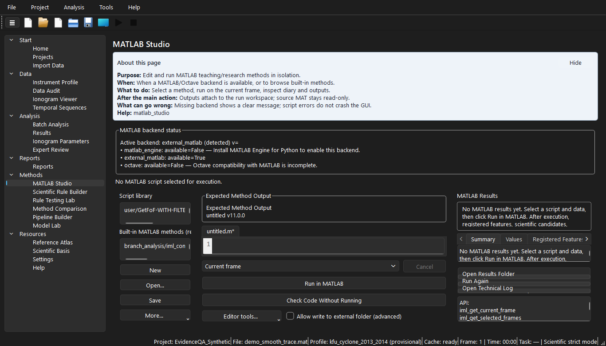

- **Purpose:** Library, editor, managed run, structured result tabs.
- **When to use:** When testing optional MATLAB methods.
- **Prerequisites:** Configured backend + selected script + MAT.
- **Controls:** Check Code Without Running / Run in MATLAB / Cancel; Format / Save copy / Compare; result actions + More actions menu.
- **Validate vs Run:** Check Code Without Running inspects editor structure only — MATLAB is not started and no science is computed. Run in MATLAB executes the selected method via the configured backend.
- **Expected Method Output:** Before a run, the panel states whether the method is expected to produce values, registered features/candidates, tables, matrices, figures, files, or warning-only results (from method metadata — not every method creates an image).
- **Effect:** Runs script via JobManager; shows Studio results only (Summary / Values / Features / Candidates / Figures / Tables / Matrices / Files / Warnings / Technical Log / Provenance).
- **Output:** Run-specific output folder; numeric values under Values; figures under Figures; files under Created Files. Registered candidates can be added to Method Comparison; they do not enter main Results automatically. An enabled registered plugin may be selected for future batch analysis only after explicit opt-in.
- **Common mistake:** Assuming Studio output entered main Results, or that exit code 0 means scientific success.
- **Scientific limitation:** Not part of default automatic analysis.
- **Next step:** Method Comparison / Pipeline Builder.

</details>


<details>
<summary><strong>Rule Builder</strong></summary>

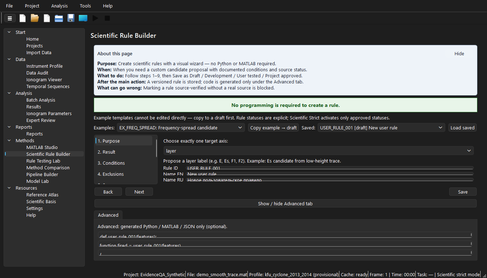

- **Purpose:** Author versioned rule packs with citations.
- **When to use:** When extending development rules carefully.
- **Prerequisites:** Writable rules workspace.
- **Controls:** Wizard fields; save/export pack.
- **Effect:** Writes rule pack metadata.
- **Output:** Rule pack files.
- **Common mistake:** Enabling unsupported URSI numeric thresholds.
- **Scientific limitation:** Custom rules need independent validation.
- **Next step:** Rule Testing.

</details>


<details>
<summary><strong>Rule Testing</strong></summary>

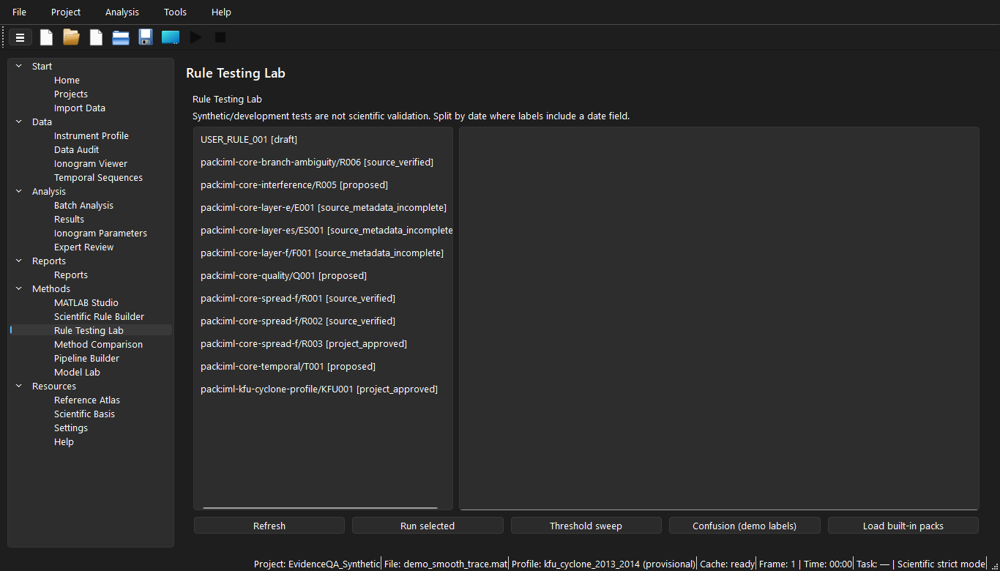

- **Purpose:** Test rule packs against labeled or synthetic cases.
- **When to use:** After editing a rule pack.
- **Prerequisites:** Rule pack + test cases.
- **Controls:** Run tests / view diffs.
- **Effect:** Shows pass/fail and disagreements.
- **Output:** Test reports under workspace.
- **Common mistake:** Treating synthetic pass as external validation.
- **Scientific limitation:** Not a substitute for expert-confirmed datasets.
- **Next step:** Results / Method Comparison.

</details>


<details>
<summary><strong>Method Comparison</strong></summary>

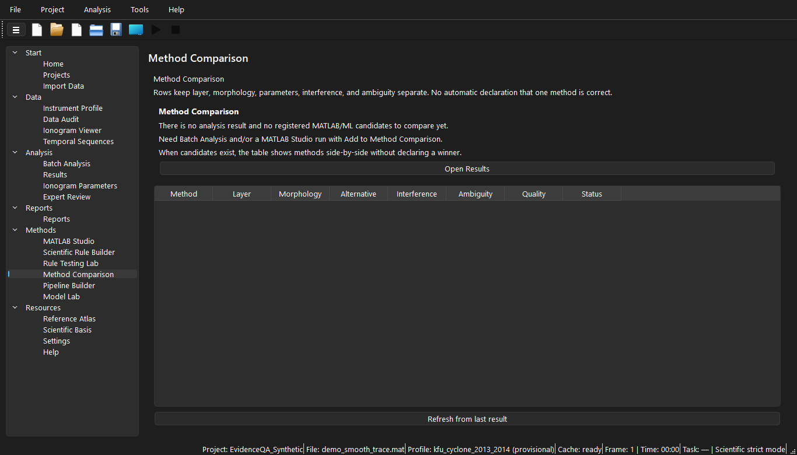

- **Purpose:** Side-by-side Python / MATLAB / ML / expert rows.
- **When to use:** When multiple candidates exist.
- **Prerequisites:** Analysis result and/or MATLAB candidates.
- **Controls:** Refresh.
- **Effect:** Displays separate axes; no automatic winner.
- **Output:** None unless exported.
- **Common mistake:** Assuming one method is declared correct.
- **Scientific limitation:** Comparison does not fuse ensembles by default.
- **Next step:** Pipeline Builder.

</details>


<details>
<summary><strong>Pipeline Builder</strong></summary>

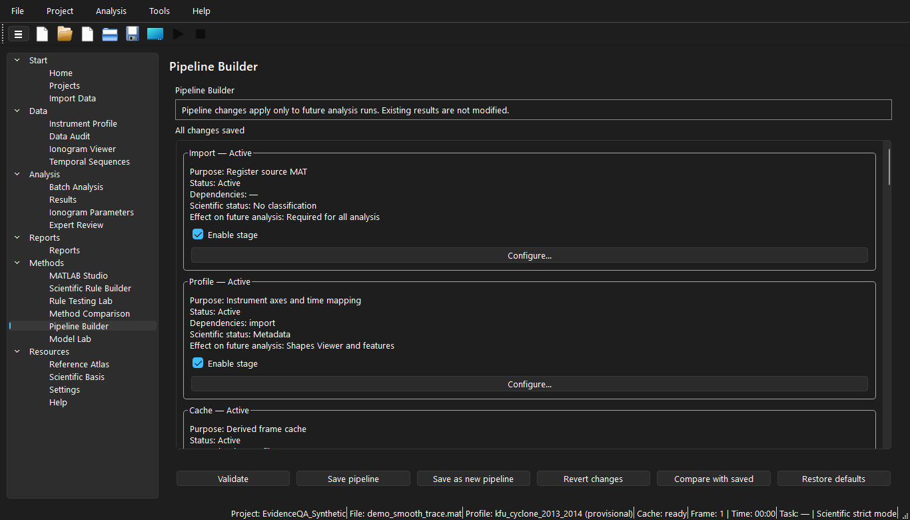

- **Purpose:** Compose optional stages (does not silently enable MATLAB/ML).
- **When to use:** When documenting a custom stage order for future analysis.
- **Prerequisites:** Project context.
- **Controls:** Stage cards (purpose, status, dependencies, implementation); Validate / Save / Save as / Revert / Compare with saved / Restore defaults.
- **Effect:** Pipeline edits apply only to future analysis runs. Existing results are never rewritten. Unavailable stages cannot be enabled silently.
- **Output:** Pipeline config files.
- **Common mistake:** Expecting checkbox edits to change past Results, or enabling untrusted plugins without review.
- **Scientific limitation:** Default Batch path remains Python RuleEngine unless changed.
- **Next step:** Batch Analysis.

</details>


<details>
<summary><strong>Model Lab</strong></summary>

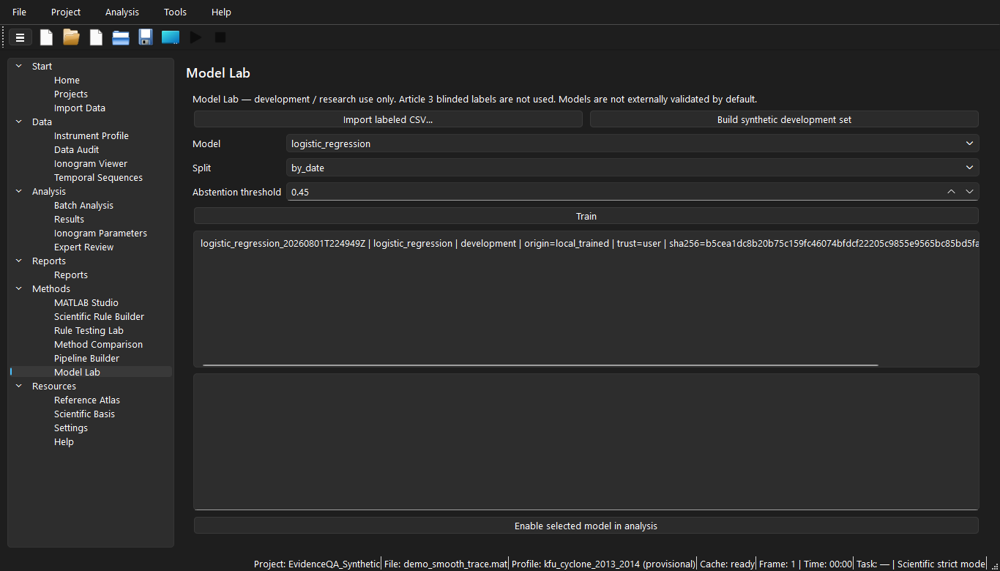

- **Purpose:** Development ML train/compare; disabled in default analysis.
- **When to use:** Research prototyping only.
- **Prerequisites:** Labeled CSV or synthetic set.
- **Controls:** Import CSV; Build synthetic; Train; Enable model.
- **Effect:** Trains development models with local metrics.
- **Output:** Model cards under model_lab/.
- **Common mistake:** Enabling foreign joblib without trust prompt care.
- **Scientific limitation:** Not externally validated; not default pipeline.
- **Next step:** Settings / Method Comparison.

</details>


<details>
<summary><strong>Settings</strong></summary>

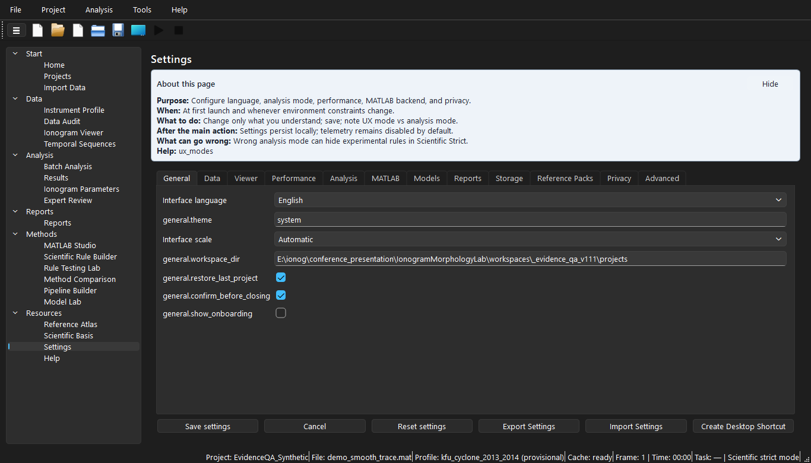

- **Purpose:** Language, scale, storage, MATLAB backends, privacy.
- **When to use:** Anytime configuration is needed.
- **Prerequisites:** Writable settings store.
- **Controls:** Tabs General…Advanced; Save/Reset; Storage actions.
- **Effect:** Persists preferences; never rewrites source MAT.
- **Output:** settings store / shortcuts.
- **Common mistake:** Pointing cache into source data folders.
- **Scientific limitation:** Settings do not change scientific thresholds silently.
- **Next step:** Help.

</details>


<details>
<summary><strong>Help</strong></summary>

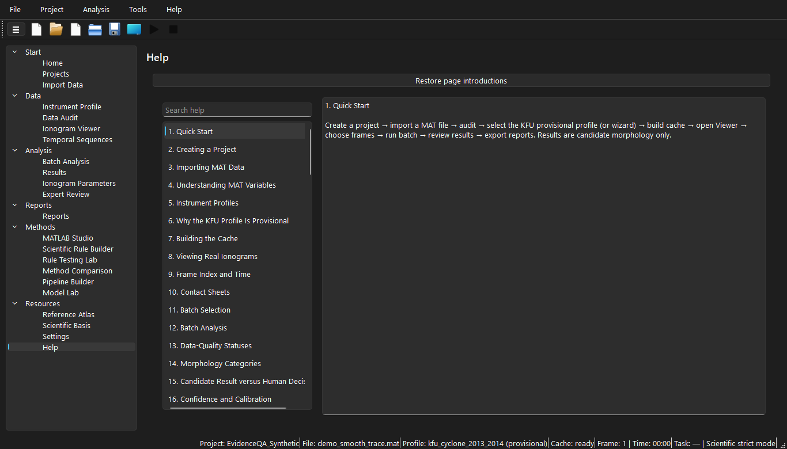

- **Purpose:** In-app topics and restore intros.
- **When to use:** When a control meaning is unclear.
- **Prerequisites:** Bundled help content.
- **Controls:** Search; topic list; Restore introductions.
- **Effect:** Shows localized help body.
- **Output:** None.
- **Common mistake:** Skipping Help when results look 'confirmed'.
- **Scientific limitation:** Help text is guidance, not validation.
- **Next step:** Return to Home workflow.

</details>

## Documentation map

| Document | Role |
|----------|------|
| [USER_GUIDE_EN.md](docs/USER_GUIDE_EN.md) | Complete control reference |
| [USER_GUIDE_RU.md](docs/USER_GUIDE_RU.md) | Полный справочник элементов |
| [SCIENTIFIC_DECISION_MAP.md](docs/SCIENTIFIC_DECISION_MAP.md) | Default analysis path |
| [CLASSIFICATION_VALIDATION_REPORT.md](docs/CLASSIFICATION_VALIDATION_REPORT.md) | Validation status |

## License / citation

See repository `LICENSE` and science claim packs. Cite IML version **1.1.1** with the analysis run id from Reports.
