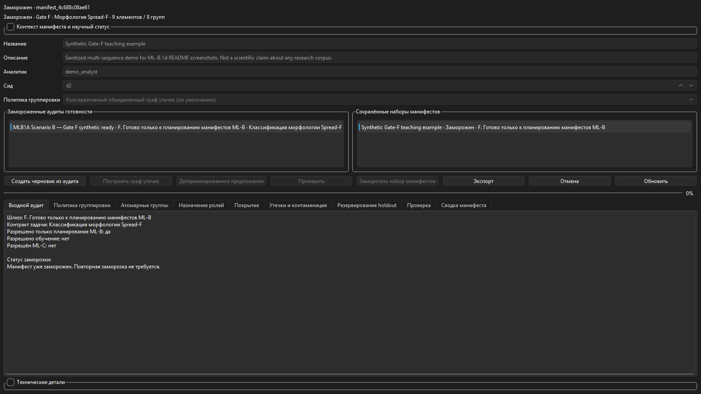
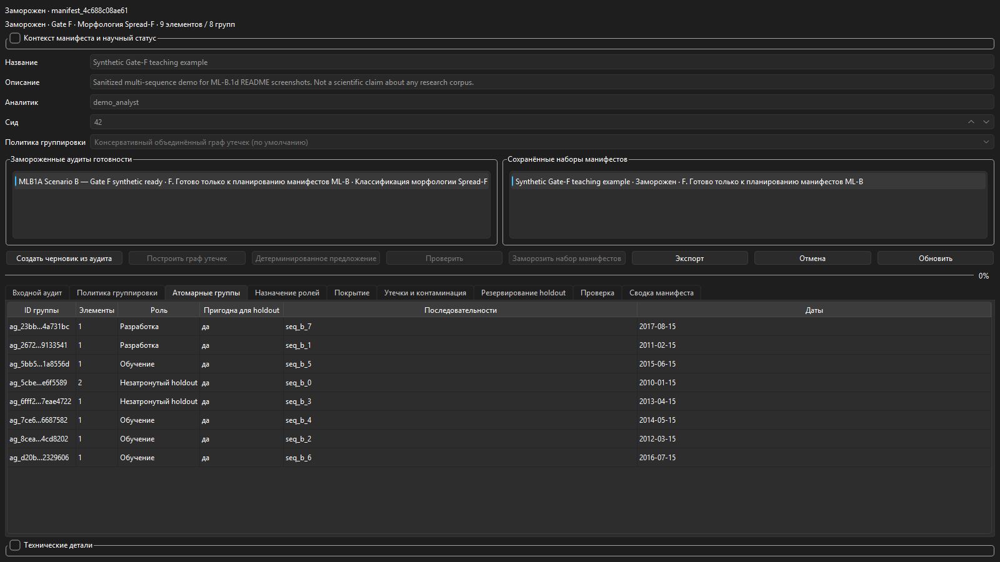
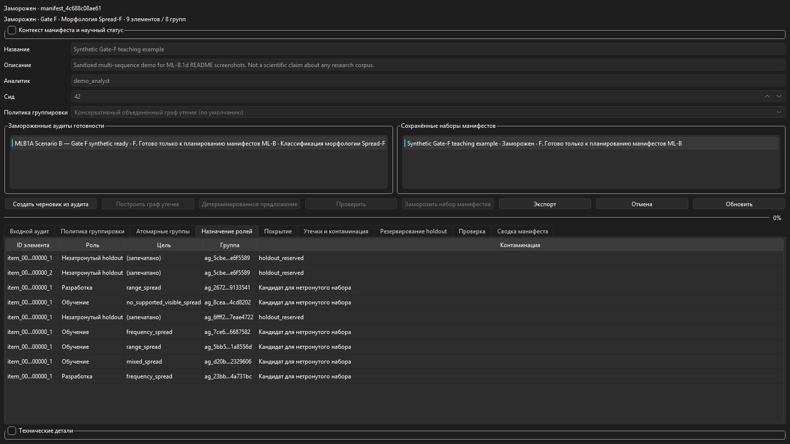
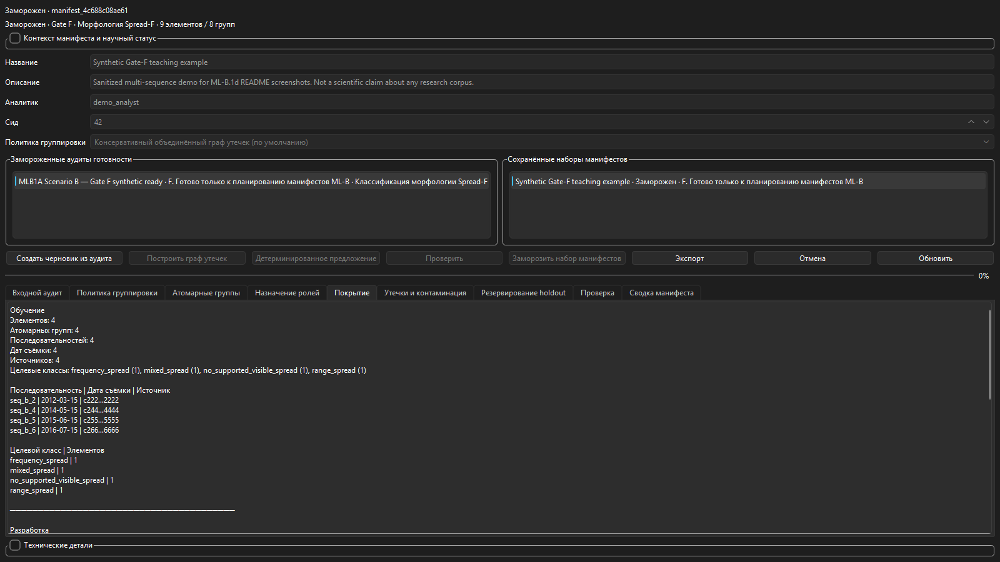
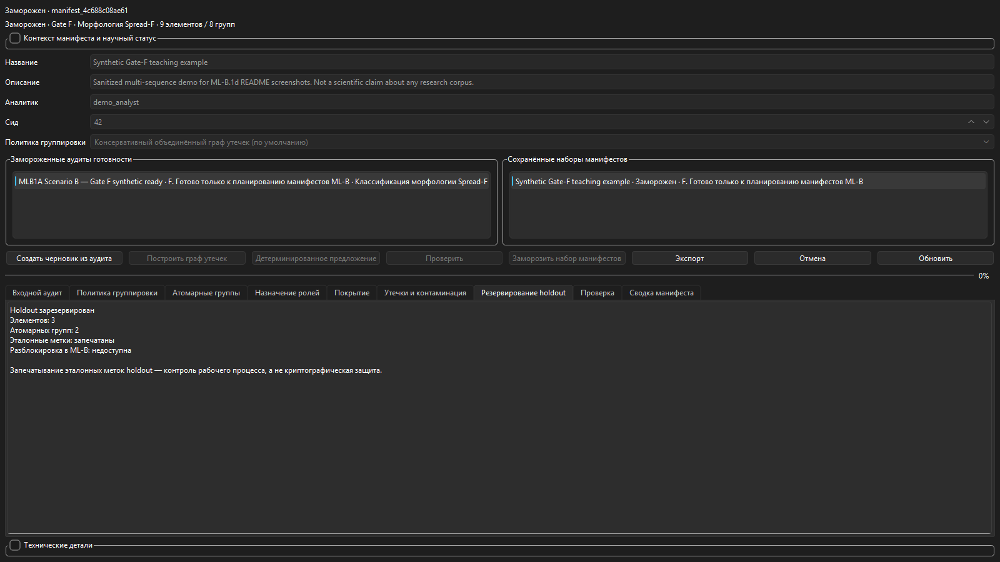
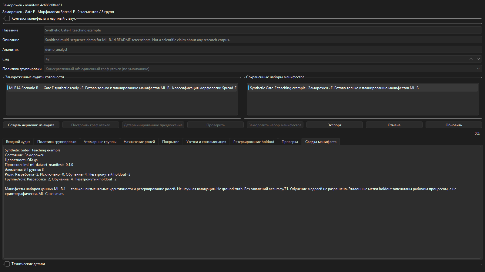

# Ionogram Morphology Lab

[English](README.md) | [Русский](README_RU.md) · **Релиз 1.1.1** · **Build Identity: ML-B.1d**

Ionogram Morphology Lab (IML) — двуязычное (EN/RU) настольное исследовательское приложение для **трассируемого анализа морфологии ионограмм**, экспертных кампаний проверки, анализа расхождений, аудитов готовности данных, манифестов наборов без утечек, тестирования правил и экспорта отчётов. Импортирует выбранные пользователем MATLAB (`.mat`) данные, сохраняет происхождение и держит морфологию, неоднозначность, качество и параметры на **раздельных научных осях**.

> **Научный статус:** результат — **кандидат** морфологии или предложения параметра. Это **не** доказательство физического механизма, не замена экспертного скейлинга и не валидация модели. Экспертные метки — решения человека, а не ground truth. Модели разработки и пользовательские правила требуют независимой валидации. **Готовность данных для ML** и **манифесты наборов данных ML** — только планирование/управление и **не** разрешают обучение моделей. **ML-C не начат.**



*Манифесты наборов данных ML — замороженный синтетический учебный пример Gate F (компактный вид). Галерея: `docs/assets/screenshots/ml-b1d/`.*

## Возможности

- Локальный импорт MAT с инвентарём / аудитом (исходные файлы не перезаписываются)
- Просмотрщик ионограмм, временные последовательности, пакетный анализ, двуязычные отчёты
- Путь Python RuleEngine по умолчанию (MATLAB Studio и Model Lab — опциональны / не по умолчанию)
- Корпуса и кампании экспертной проверки со слепыми кругами, раскрытием/сравнением и арбитражем
- Анализ расхождений (описательный; ни эксперт, ни кандидат не считаются ground truth)
- **Готовность данных для ML (ML-A.1a.2):** инвентарь, покрытие классов, источники/даты, контаминация, оценка holdout, Gate A–F (F = только планирование ML-B)
- **Манифесты наборов данных ML (ML-B.1d):** неизменяемые манифесты ролей, атомарные группы без утечек, роли train / development / untouched holdout (метки запечатаны процессом); по-прежнему **без обучения**; **ML-C не начат**
- Интерфейс, справка и документация EN/RU

## Сравнение модулей

| Модуль | Назначение | Даёт | **Не** делает |
|--------|------------|------|----------------|
| Импорт / Аудит / Профиль | Регистрация MAT, инвентарь, оси прибора | Артефакты инвентаря / аудита | Классификацию морфологии |
| Просмотрщик / Последовательности | Просмотр кадров и времени | Отображение / контактные листы | Экспертные метки или обучающие наборы |
| Пакет / Результаты | Кандидатный конвейер Python | Кандидаты + происхождение запуска | Подтверждённую науку / URSI-скейлинг |
| Корпуса экспертной проверки | Слепые оценки на замороженных когортах | Заблокированные отзывы, reveal/compare | Ground truth; разрешение обучения |
| Кампании экспертной проверки | Операции пилота по многим источникам/датам | Манифесты / прогресс кампании | Заявления о научной валидации |
| Анализ расхождений | Описать паттерны эксперт↔кандидат / эксперт↔эксперт | Замороженный описательный снимок + gate | Accuracy/F1; объявить победителя |
| Готовность данных для ML | Готовность данных/меток для контракта задачи | Замороженный аудит + экспорт | Обучение моделей; финальные holdout-манифесты |
| Манифесты наборов данных ML | Резервирование train/dev/holdout без утечек | Замороженный набор манифестов + публичный экспорт | Обучение; разблокировка holdout; ML-C |
| MATLAB Studio / Model Lab | Опциональные методы / прототипирование | Артефакты Studio / model_lab | Анализ по умолчанию |
| Конструктор / Тест правил | Версионированные пакеты правил | Пакеты / отчёты тестов | Внешнюю валидацию сами по себе |

## Сквозной пользовательский процесс

1. **Установите или распакуйте** приложение; рабочая область — вне папки установки; выберите EN или RU.
2. **Создайте или откройте проект** (Проекты). Для первых запусков используйте `synthetic_data/`.
3. **Импортируйте MAT** без перезаписи источника; подтвердите **профиль прибора**; выполните **аудит данных**.
4. **Просмотрите** кадры; при необходимости постройте временные последовательности.
5. Запустите **пакетный анализ** (путь Python по умолчанию); смотрите **Результаты** только как кандидатов.
6. Соберите **корпус экспертной проверки**, завершите **слепые** круги, затем раскрытие/сравнение (кампании — при многих источниках/датах).
7. При необходимости выполните **Анализ расхождений** по раскрытым корпусам (только описание).
8. Запустите **Готовность данных для ML** для выбранного контракта задачи; заморозьте аудит; прочитайте Gate. Исход **F** — только *планирование* ML-B, **без обучения**.
9. При Gate F откройте **Манифесты наборов данных ML**, постройте атомарные группы, зарезервируйте роли, заморозьте набор (метки holdout остаются запечатанными). По-прежнему **без обучения** / без ML-C.
10. Экспортируйте отчёты / аудиты готовности / публичные манифесты. Исследовательские MAT и runtime-аудиты не помещайте в git.

## Избранные снимки (ML-B.1d)

PNG 1600×900 из UI **ML-B.1d** на санитизированном синтетическом учебном примере Gate F. Без личных путей и учётных данных. У каждой сцены есть пара EN/RU в `docs/assets/screenshots/ml-b1d/`.

<details>
<summary><strong>Манифесты — компактный обзор</strong></summary>


*Замороженный учебный пример — компактный статус, статус заморозки, Технические детали свёрнуты. EN: `manifests_overview_en.png`.*

</details>

<details>
<summary><strong>Атомарные группы</strong></summary>



*Атомарные группы без утечек — никогда не разделяются по ролям. EN: `atomic_groups_en.png`.*

</details>

<details>
<summary><strong>Назначение ролей</strong></summary>



*Резервирование train / development / untouched holdout (при Frozen цели запечатаны). EN: `role_assignment_en.png`.*

</details>

<details>
<summary><strong>Покрытие (человекочитаемое)</strong></summary>



*Счётчики по ролям; сокращённые идентификаторы источников. EN: `coverage_en.png`.*

</details>

<details>
<summary><strong>Резервирование holdout (заморожено / запечатано)</strong></summary>



*Holdout зарезервирован; эталонные метки запечатаны; разблокировка в ML-B недоступна. EN: `holdout_reservation_en.png`.*

</details>

<details>
<summary><strong>Сводка манифеста</strong></summary>



*Замороженная сводка — целостность / роли / протокол; без заявления об обучении. EN: `validation_summary_en.png`.*

</details>

Предыдущие снимки готовности / главной сохранены в [`docs/assets/screenshots/ml-a1a2/`](docs/assets/screenshots/ml-a1a2/) (не перезаписаны). Более старые снимки: [`docs/assets/screenshots/v1.1.1/`](docs/assets/screenshots/v1.1.1/).

## Быстрый старт

См. [Руководство пользователя](docs/USER_GUIDE_RU.md), [Установка](docs/INSTALLATION_RU.md). Portable: распакуйте, держите файлы вместе, используйте записываемую рабочую область вне папки установки.

```bash
python -m venv .venv
.venv\Scripts\activate
pip install -e ".[dev]"
python -m ionogram_morphology_lab.app.main
```

Упакованный EXE (при распространении): запускайте `IonogramMorphologyLab.exe` из portable-папки. Текущий Build Identity: **ML-B.1d**.

1. Выберите язык · 2. Новый проект · 3. Начните с `synthetic_data/` · 4. Следуйте шагам на Главной.

## Проекты и данные MAT

<details>
<summary><strong>Проекты</strong></summary>

- **Назначение:** безопасно создавать, открывать и переключать проекты анализа.
- **Когда использовать:** до импорта MAT или при смене рабочей области.
- **Условия:** записываемый путь для создания; существующий путь проекта для открытия.
- **Элементы управления:** карточка текущего проекта (имя, путь, создан, последнее открытие, активный источник, активный запуск, несохранённые изменения); Открыть проект; Выбрать папку проекта; Открыть недавний проект; Удалить из списка недавних; Создать проект.
- **Эффект:** загружает или создаёт метаданные проекта; перед переключением останавливает/завершает активные задания, предупреждает о несохранённых правках, очищает устаревшее состояние UI, чтобы не смешивать результаты разных проектов.
- **Результат:** каталог проекта и записи БД; список недавних проектов в настройках.
- **Частая ошибка:** создание внутри папки portable EXE; игнор предупреждений о несохранённом или активном задании.
- **Научное ограничение:** создание проекта не подтверждает научный результат.

</details>

- Проект хранит метаданные, кэши, запуски, корпуса/кампании и аудиты готовности.
- Импорт регистрирует выбранный пользователем путь `.mat`; IML не перезаписывает `Amp_all` и другие исходные массивы.
- Для демо и документации предпочтительны учебные файлы в `synthetic_data/`.
- Исследовательские MAT, локальные БД и сгенерированные экспорты review/readiness не коммитьте.

## Корпуса, кампании и слепая проверка

- **Корпуса экспертной проверки** — замороженные когорты, слепые отзывы, reveal/compare, опциональный арбитраж.
- **Кампании** организуют пилот по многим источникам/датам без заявлений о научной валидации.
- Слепые круги должны быть завершены до раскрытия; метки кандидатов не должны попадать в слепой просмотр.
- Исправленные отзывы — ревизии с происхождением, а не независимые вторые мнения, если не зафиксирован отдельный рецензент/круг.

## Анализ расхождений

Только для чтения описательный слой над раскрытыми корпусами/кампаниями (`iml-disagreement-analysis-0.1.0`). Суммирует переходы и страты, фиксирует decision gate аналитика. Не объявляет ground truth и не считает accuracy.


*Анализ расхождений — вкладка выбора/заморозки; синтетическая когорта `demo_pilot_example`.*

## Готовность данных для ML (ML-A.1a.2)

Протокол: `iml-ml-dataset-readiness-0.1.0`. Shadow-only аудит и управление:

- Инвентарь экспертно размеченных элементов для контракта задачи (семейство A–D)
- Покрытие классов, пропуски, независимость рецензентов
- Проверки контаминации (элементы, уже виденные в разработке; связанные группы кадров; последовательности)
- **Оценка** возможности holdout (не финальный holdout-набор)
- Исходы Gate A–F; **F разрешает только планирование манифестов ML-B**
- Всегда: `authorizes_training=False`; без заявлений accuracy/F1/sensitivity/specificity


*Готовность данных для ML — выбор и заморозка. Подзаголовок страницы фиксирует ограничения аудита.*

## Манифесты наборов данных ML (ML-B.1d)

Протокол: `iml-ml-dataset-manifests-0.1.0`. Планирование только в shadow-режиме поверх замороженного аудита готовности:

- Детерминированный граф утечек → **атомарные группы**, которые никогда не разделяются по ролям набора
- Роли: **train**, **development**, **untouched holdout**, excluded (только резервирование идентичностей — не обучение)
- Финальная заморозка только при Gate **F** (только планирование); при не-F допустима черновая симуляция, заморозка блокируется
- Публичный holdout-манифест без целевых меток; эталонные метки **запечатаны процессом** (не криптография); ML-B не разблокирует их
- Всегда: `authorizes_training=False`; **ML-C не начат**; без заявлений accuracy/F1

### Сценарий A — научно заблокированный пилот (пример)

Пилот с одной последовательностью и полной development-exposed контаминацией (дата съёмки `2014-10-15`) корректно даёт **ноль** групп для нетронутого holdout и **блокирует заморозку**. Это ожидаемый научный результат, не сбой ПО.

### Сценарий B — синтетический Gate F (только учебный пример)

Снимки README используют **санитизированный синтетический учебный пример Gate F** (несколько последовательностей и дат). Иллюстративные счётчики после заморозки: train 4 / 4; development 2 / 2; untouched holdout 3 / 2; Integrity PASS. Это **не** научное утверждение о исследовательском корпусе и **не** разрешение на обучение.

## Целостность и контаминация

- Метки кандидатов исключаются из экспертных целевых распределений покрытия готовности.
- Элементы, уже виденные в disagreement/разработке, не входят в «нетронутый» holdout как чистые.
- Связанные группы кадров / последовательности не считаются случайно разделимыми единицами.
- Замороженные аудиты неизменяемы; исправленные ревизии получают новый identity и сохраняют родителя.
- Даты съёмки следуют документированному порядку авторитета; время кадра не подменяет дату источника.
- Экспорт убирает абсолютные пути владельца там, где это требуют контракты readiness/disagreement.

## Установка и запуск (проверенные пути)

| Путь | Примечание |
|------|------------|
| Dev: `pip install -e ".[dev]"` затем `python -m ionogram_morphology_lab.app.main` | Для разработчиков |
| Portable EXE | Распаковать папку; запускать EXE; workspace вне каталога установки |
| MATLAB | Опционально; не нужен для анализа Python по умолчанию |

## Разработка и проверка

Типичные проверки:

```bash
python -m pytest
python scripts/validate_feature_registry_v2.py
python scripts/validate_synthetic_geometry_v2.py
python scripts/validate_ml_dataset_readiness.py
python scripts/validate_ml_dataset_manifests.py
python scripts/validate_morphology_disagreement_analysis.py
python scripts/validate_i18n.py
python scripts/validate_docs.py
python scripts/check_repository_hygiene.py
```

Доказательства release gate для **ML-B.1d**: **834** pytest; все release-валидаторы + hygiene OK; owner visual QA PASS; принятый SHA-256 EXE `132242FAFAA5C30D09C8FAE13C0795CEECD6B7CDDDB68CC56C0CCC03C4C32E80`. См. [`docs/MLB1_FINAL_RELEASE_GATE_REPORT.md`](docs/MLB1_FINAL_RELEASE_GATE_REPORT.md).

## Структура репозитория (кратко)

| Путь | Роль |
|------|------|
| `src/ionogram_morphology_lab/` | Пакет приложения (UI, анализ, готовность, review) |
| `scripts/` | Валидаторы и утилиты |
| `tests/` | Pytest |
| `docs/` | Руководства, отчёты приёмки, снимки |
| `synthetic_data/` | Учебные MAT |
| `rule_packs/` | Версионированные пакеты правил |
| `dist/` | Локальные сборки (не коммитятся) |

## Безопасность runtime и git

**Не коммитьте:** владелецские MAT, runtime `review_dataset/`, экспорты readiness/disagreement, локальные workspace, кэши, `build/`, `dist/`, личные настройки, секреты. Ориентируйтесь на списки включения в отчётах фаз / final gate.

## Устранение неполадок

| Симптом | Что проверить |
|---------|----------------|
| Пустой просмотрщик | Проект + MAT + профиль; пересобрать кэш после аудита |
| Пакет «не использовал» MATLAB/ML | Путь по умолчанию — Python RuleEngine (ожидаемо) |
| Раскрытие слепой проверки заблокировано | Сначала завершите обязательный слепой круг |
| Gate не F / нет обучения | Обучение никогда не разрешается; F — только планирование |
| Прогресс «завис» после freeze | В ML-A.1a.2 успех должен быть на 100%, Cancel отключён |
| Абсолютные пути в экспорте | Используйте экспорт по контракту; не коммитьте исследовательские данные |

## Дорожная карта

- **Сделано:** ML-A.1 → ML-A.1a.2 готовность данных (shadow-only).
- **Сделано (этот релиз):** **ML-B.1 → ML-B.1d** неизменяемые манифесты и резервирование ролей без утечек (shadow-only; без обучения).
- **Не начато:** **ML-C** (любой эксперимент/обучение модели).
- MATLAB Studio / Model Lab остаются опциональными исследовательскими поверхностями.

## Карта документации

| Документ | Роль |
|----------|------|
| [USER_GUIDE_RU.md](docs/USER_GUIDE_RU.md) | Полный справочник элементов управления |
| [USER_GUIDE_EN.md](docs/USER_GUIDE_EN.md) | Complete control reference |
| [SCIENTIFIC_DECISION_MAP.md](docs/SCIENTIFIC_DECISION_MAP.md) | Путь анализа по умолчанию |
| [MLB1_FINAL_RELEASE_GATE_REPORT.md](docs/MLB1_FINAL_RELEASE_GATE_REPORT.md) | Release gate ML-B.1d |
| [MLA1_FINAL_RELEASE_GATE_REPORT.md](docs/MLA1_FINAL_RELEASE_GATE_REPORT.md) | Предыдущий release gate ML-A.1a.2 |

## Лицензия / цитирование

См. `LICENSE` и пакеты научных утверждений. Указывайте версию IML **1.1.1**, Build Identity **ML-B.1d** и id запуска из Отчётов.
