# Ionogram Morphology Lab

[English](README.md) | [Русский](README_RU.md) · **Релиз 1.1.1**

Ionogram Morphology Lab (IML) — двуязычное (EN/RU) настольное исследовательское приложение для **трассируемого анализа морфологии ионограмм**, экспертной проверки, тестирования правил и экспорта отчётов. Импортирует выбранные пользователем MATLAB (`.mat`) данные, сохраняет происхождение и держит морфологию, неоднозначность, качество и параметры на **раздельных научных осях**.

> **Научный статус:** результат — **кандидат** морфологии или предложения параметра. Это **не** доказательство физического механизма, не замена экспертного скейлинга и не валидация модели.

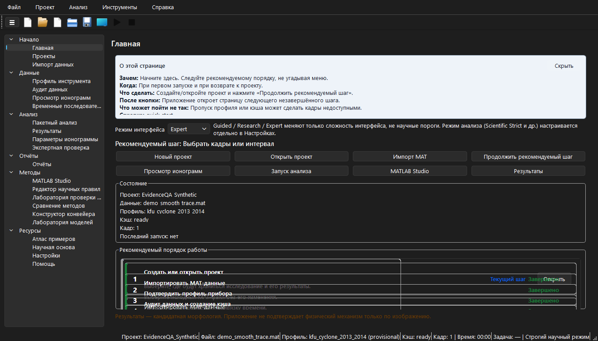

Снимки сделаны на синтетических демонстрационных данных: `docs/assets/screenshots/v1.1.1/`.

## Назначение

IML поддерживает радиофизические рабочие процессы: просмотр кадров с документированным контекстом прибора, запись кандидатов с неопределённостью, применение версионированных правил и экспорт отчётов без перезаписи исходных MAT.

## Автоматический анализ по умолчанию (v1.1.1)

Активно: проверка данных · сегментация трассы/помех · признаки Python · RuleEngine · **метаданные** эталонного атласа · флаги разногласий.

Отключено / недоступно по умолчанию: методы MATLAB Studio · модели Model Lab · ансамблевое объединение · попиксельное сравнение с рисунками из книг.

На странице «Результаты» показана панель **«Что используется в этом анализе»**.

## Установка и быстрый старт

См. [Руководство пользователя](docs/USER_GUIDE_RU.md), [Установка](docs/INSTALLATION_RU.md).

1. Выберите язык · 2. Новый проект · 3. Начните с `synthetic_data/` · 4. Следуйте шагам на Главной.

## Визуальный тур (все страницы)

Снимки из упакованного UI на безопасных синтетических данных. Личные пути исключены.

<strong>Главная</strong>

- **Назначение:** Стартовая панель и рекомендуемый рабочий процесс.
- **Когда использовать:** При первом запуске или выборе следующего безопасного шага.
- **Предпосылки:** Доступная для записи рабочая область проекта.
- **Элементы управления:** Продолжить рекомендуемый шаг; режим UX; Новый проект.
- **Эффект:** Открывает следующую страницу или создаёт проект.
- **Выход:** Папка проекта / смена навигации.
- **Частая ошибка:** Пропуск импорта перед Просмотрщиком.
- **Научное ограничение:** Сама по себе не анализирует кадры.
- **Следующий шаг:** Проекты или Импорт.

<strong>Проекты</strong>

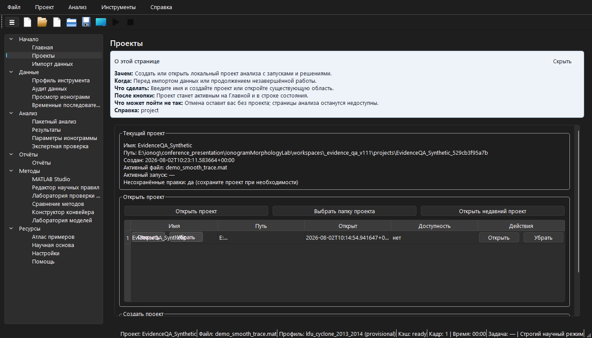

- **Назначение:** Безопасно создавать, открывать и переключать проекты анализа.
- **Когда использовать:** До импорта MAT или при смене рабочей области.
- **Предпосылки:** Записываемый путь для создания; существующий путь проекта для открытия.
- **Элементы управления:** Карточка текущего проекта (имя, путь, создан, последнее открытие, активный источник, активный запуск, несохранённые изменения); Открыть проект; Выбрать папку проекта; Открыть недавний проект; Удалить из списка недавних; Создать проект.
- **Эффект:** Загружает или создаёт метаданные; перед сменой — останавливает/разрешает активные задачи, предупреждает о несохранённых правках, очищает устаревшее состояние UI, чтобы не смешивать результаты двух проектов.
- **Выход:** Каталог проекта и записи БД; список недавних проектов в настройках.
- **Частая ошибка:** Создание внутри папки portable EXE; игнор предупреждений о несохранённых правках или активных задачах.
- **Научное ограничение:** Создание проекта не валидирует науку.
- **Следующий шаг:** Импорт.

<strong>Импорт</strong>

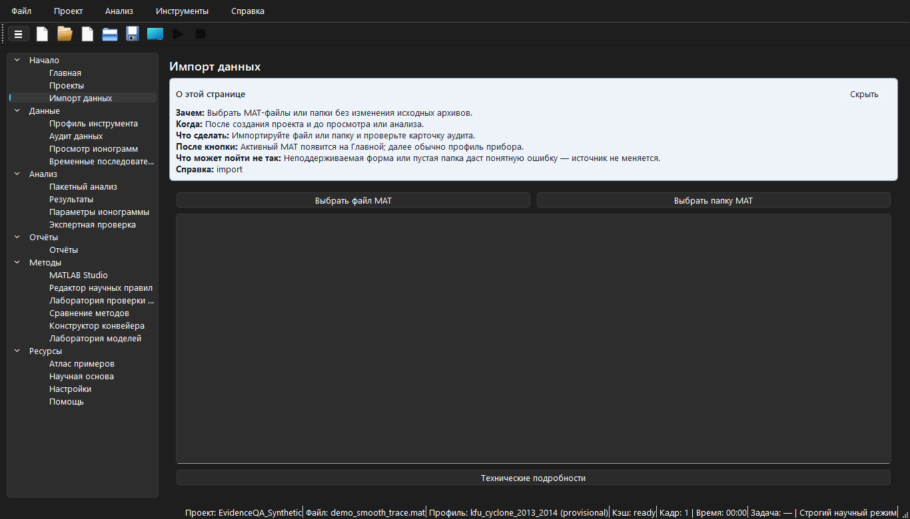

- **Назначение:** Выбор MAT-файла/папки без перезаписи источника.
- **Когда использовать:** После создания проекта.
- **Предпосылки:** Активный проект.
- **Элементы управления:** Выбрать файл; Выбрать папку; Технические сведения.
- **Эффект:** Регистрирует путь источника и инвентарь.
- **Выход:** Только инвентарь / артефакты аудита.
- **Частая ошибка:** Ожидание, что IML перезапишет Amp_all.
- **Научное ограничение:** Импорт не классифицирует морфологию.
- **Следующий шаг:** Проверка данных / Профиль.

<strong>Профиль</strong>

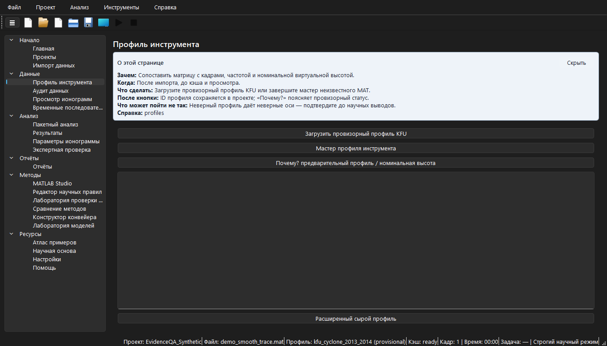

- **Назначение:** Оси прибора, привязка времени, статус проверки.
- **Когда использовать:** До Просмотрщика или Пакета.
- **Предпосылки:** Импортированный MAT + id профиля.
- **Элементы управления:** Выбор профиля; предупреждения о provisional.
- **Эффект:** Загружает подписи осей и привязку времени.
- **Выход:** Не изменяет исходный MAT.
- **Частая ошибка:** Принятие provisional осей за метрологию.
- **Научное ограничение:** Номинальная виртуальная высота ≠ истинная.
- **Следующий шаг:** Аудит или Просмотрщик.

<strong>Аудит</strong>

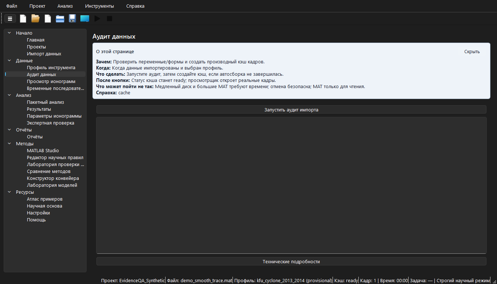

- **Назначение:** Проверки качества и инвентаря активного MAT.
- **Когда использовать:** После Импорта, до доверия Пакету.
- **Предпосылки:** Активный MAT.
- **Элементы управления:** Запуск аудита / обновление карточек.
- **Эффект:** Показывает формы переменных, предупреждения, готовность.
- **Выход:** Отчёт аудита в проекте/workspace.
- **Частая ошибка:** Игнорирование блокирующих предупреждений.
- **Научное ограничение:** Аудит ≠ классификация морфологии.
- **Следующий шаг:** Просмотрщик.

<strong>Просмотрщик</strong>

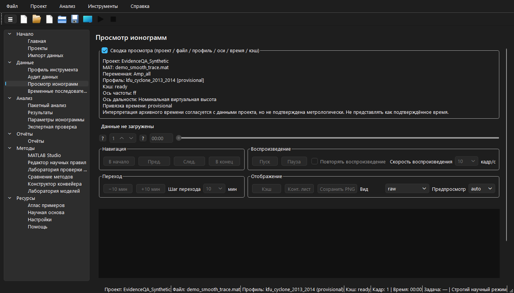

- **Назначение:** Просмотр кадров; сворачиваемая сводка; Навигация/Скачок/Воспроизведение/Отображение.
- **Когда использовать:** При просмотре доказательств до/после анализа.
- **Предпосылки:** Импортированный MAT + профиль + опциональный кэш.
- **Элементы управления:** Первый/Пред/След/Послед; ±N мин; Пуск/Пауза/Цикл; Кэш/Контакт/Сохранить; Вид/Предпросмотр.
- **Эффект:** Отрисовывает текущий кадр; кэш по запросу.
- **Выход:** Только производный кэш / PNG.
- **Частая ошибка:** Опора на быстрый предпросмотр как научное доказательство.
- **Научное ограничение:** Режимы отображения — диагностика, не URSI-скейлинг.
- **Следующий шаг:** Временные последовательности или Пакет.

<strong>Временные последовательности</strong>

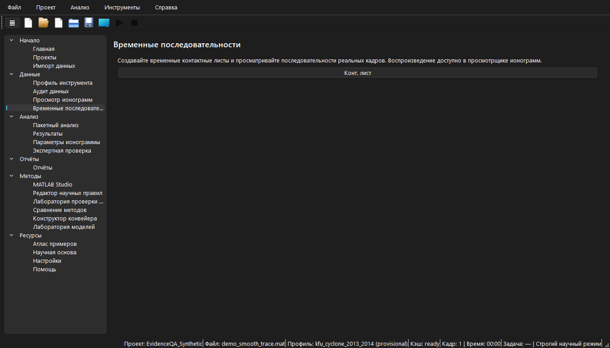

- **Назначение:** Контактные листы / последовательности.
- **Когда использовать:** При просмотре эволюции во времени.
- **Предпосылки:** Желателен готовый кэш Просмотрщика.
- **Элементы управления:** Создать контактный лист.
- **Эффект:** Пишет изображение контактного листа.
- **Выход:** PNG в workspace/reports.
- **Частая ошибка:** Контактный лист как единственное доказательство.
- **Научное ограничение:** Временной контекст необязателен для анализа по умолчанию.
- **Следующий шаг:** Пакетный анализ.

<strong>Пакетный анализ</strong>

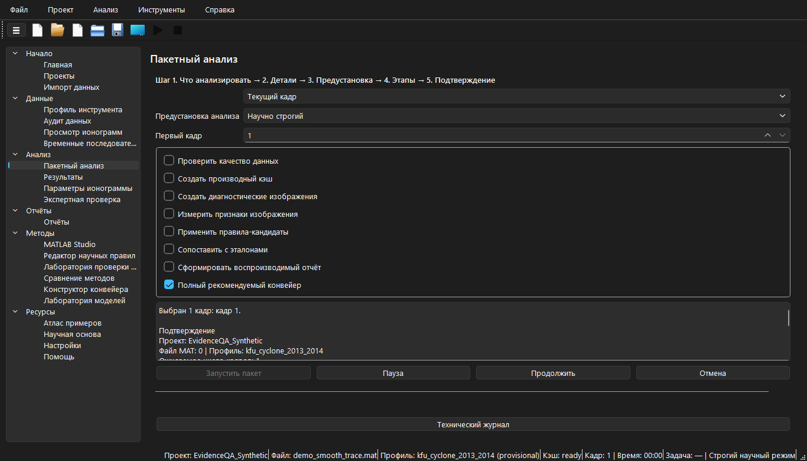

- **Назначение:** Выбор кадров и запуск конвейера Python по умолчанию.
- **Когда использовать:** Когда нужны автоматические кандидаты.
- **Предпосылки:** Проект + MAT + профиль.
- **Элементы управления:** Режим/пресет/этапы; Старт/Пауза/Продолжить/Отмена; Техжурнал.
- **Эффект:** Запускает аудит→признаки→RuleEngine→отчёты.
- **Выход:** Корень запуска с predictions JSON.
- **Частая ошибка:** Предположение, что MATLAB/Model Lab шли автоматически.
- **Научное ограничение:** Путь по умолчанию не использует MATLAB/ML.
- **Следующий шаг:** Результаты.

<strong>Результаты</strong>

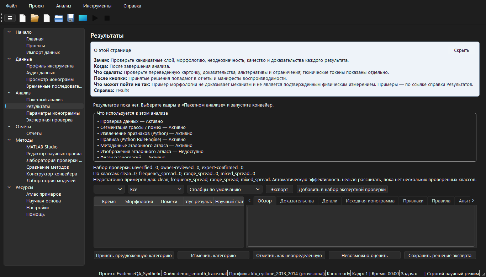

- **Назначение:** Компактная таблица + детали; панель конвейера; набор проверки; почему тип не определён.
- **Когда использовать:** После завершения Пакета.
- **Предпосылки:** last_run_root с predictions.
- **Элементы управления:** Фильтр; столбцы; Экспорт; Добавить в набор проверки; Принять/Изменить/…
- **Эффект:** Показывает статус «Автоматический кандидат» и доказательства.
- **Выход:** Экспорт / метки владельца.
- **Частая ошибка:** Чтение автоматики как подтверждения эксперта.
- **Научное ограничение:** Кандидаты — не подтверждённые классификации.
- **Следующий шаг:** Экспертная проверка или Отчёты.

<strong>Параметры</strong>

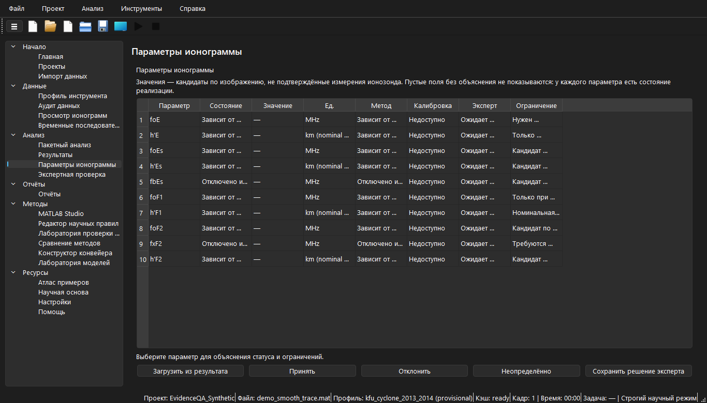

- **Назначение:** Документированные предложения параметров / пределы.
- **Когда использовать:** При проверке параметрических утверждений.
- **Предпосылки:** Контекст активного проекта.
- **Элементы управления:** Формы параметров / сохранение на странице.
- **Эффект:** Записывает provisional предложения параметров.
- **Выход:** Конфиг в проекте.
- **Частая ошибка:** Принятие предложений за калиброванный foF2.
- **Научное ограничение:** Не заменяет экспертный скейлинг.
- **Следующий шаг:** Результаты / Отчёты.

<strong>Экспертная проверка</strong>

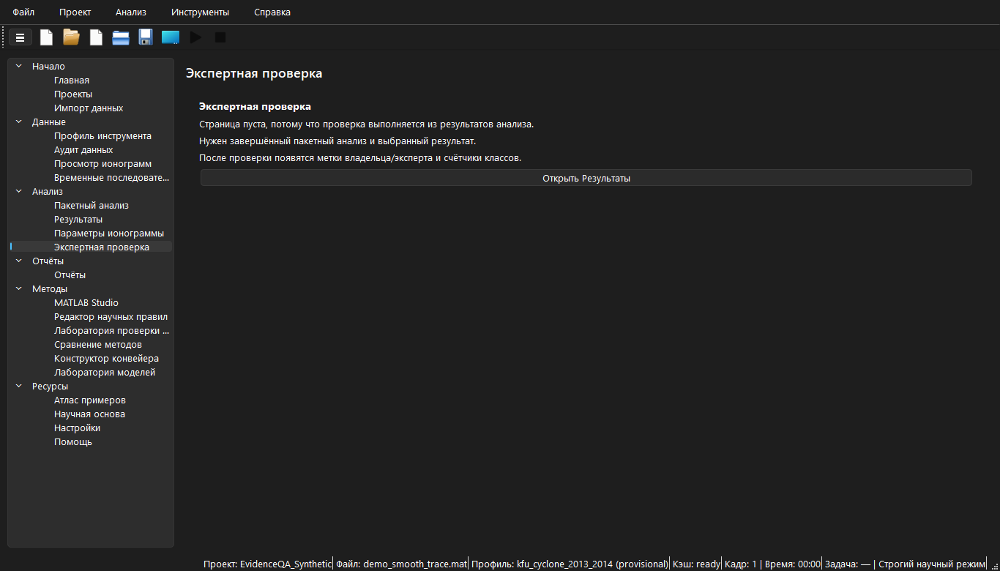

- **Назначение:** Вход к решениям владельца/эксперта через Результаты.
- **Когда использовать:** Когда нужны человеческие метки.
- **Предпосылки:** Существующая строка результата.
- **Элементы управления:** Открыть Результаты; Добавить в набор (на Результатах).
- **Эффект:** Ведёт к рабочему процессу Результаты.
- **Выход:** JSON-метки набора проверки.
- **Частая ошибка:** Называть проверку владельца экспертной.
- **Научное ограничение:** Проверено владельцем ≠ подтверждено экспертом.
- **Следующий шаг:** Результаты.

<strong>Отчёты</strong>

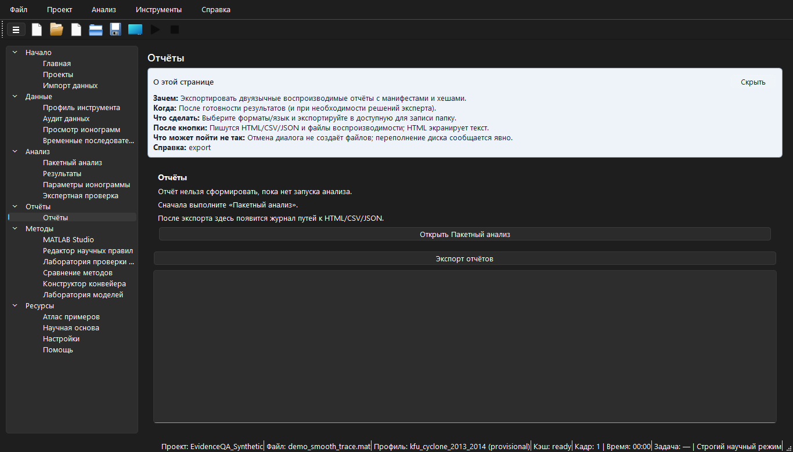

- **Назначение:** Экспорт двуязычных воспроизводимых отчётов.
- **Когда использовать:** После появления запуска.
- **Предпосылки:** last_run_root.
- **Элементы управления:** Экспорт.
- **Эффект:** Пишет HTML/CSV/JSON/MD с происхождением.
- **Выход:** Файлы отчётов в run/reports.
- **Частая ошибка:** Публикация без проверки provenance.
- **Научное ограничение:** Отчёты не повышают статус кандидата.
- **Следующий шаг:** Настройки / архив.

<strong>Эталонный атлас</strong>

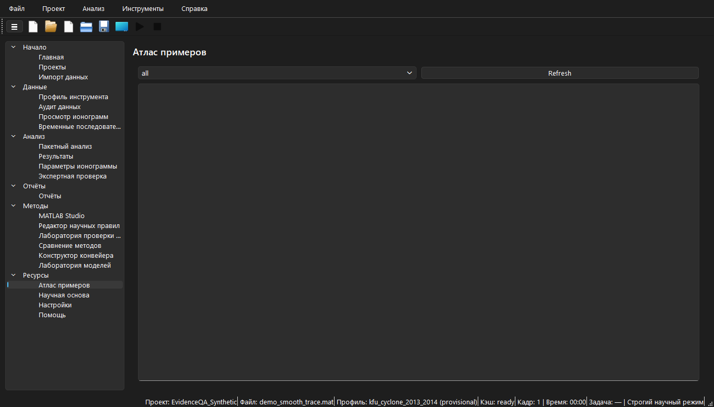

- **Назначение:** Эталонные формулировки по метаданным (изображения могут быть недоступны).
- **Когда использовать:** При сравнении формулировок / цитат.
- **Предпосылки:** Установлен пакет атласа.
- **Элементы управления:** Фильтр; список; поля деталей.
- **Эффект:** Локализованные подписи полей; названия источников сохраняются.
- **Выход:** Не меняет исходный MAT.
- **Частая ошибка:** Предположение о попиксельном сравнении с атласом.
- **Научное ограничение:** Анализ по умолчанию использует только метаданные.
- **Следующий шаг:** Научная основа.

<strong>Научная основа</strong>

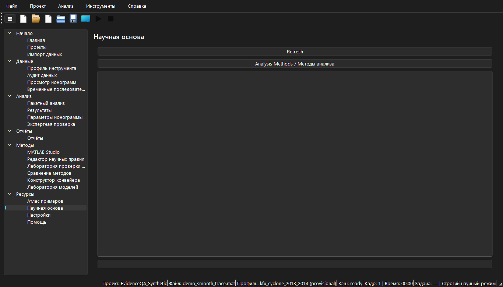

- **Назначение:** Утверждения, источники, ограничения с подписями EN/RU.
- **Когда использовать:** При документировании научной базы.
- **Предпосылки:** Встроенный научный контент.
- **Элементы управления:** Обзор разделов / техническая панель.
- **Эффект:** Показывает переведённые подписи; оригиналы сохраняются.
- **Выход:** Нет.
- **Частая ошибка:** Путать текст утверждений с автоматической валидацией.
- **Научное ограничение:** Не меняет пороги RuleEngine.
- **Следующий шаг:** Конструктор правил / Справка.

<strong>MATLAB Studio</strong>

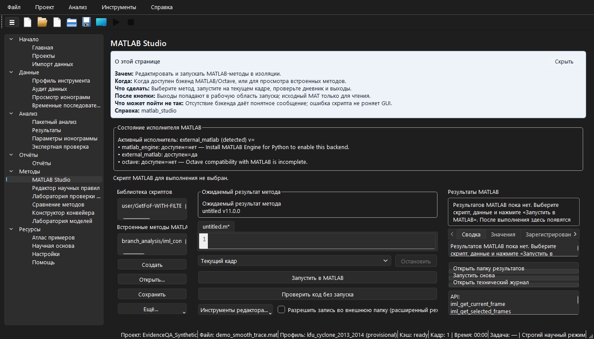

- **Назначение:** Библиотека, редактор, управляемый запуск, вкладки результата.
- **Когда использовать:** При проверке опциональных методов MATLAB.
- **Предпосылки:** Настроенный backend + скрипт + MAT.
- **Элементы управления:** Формат/Проверить/Запуск/Отмена/Копия/Сравнить; действия результата.
- **Эффект:** Запускает скрипт через JobManager; показывает только Studio-результаты.
- **Выход:** Папка конкретного запуска.
- **Частая ошибка:** Предположение, что вывод Studio попал в Результаты.
- **Научное ограничение:** Не входит в автоматический анализ по умолчанию.
- **Следующий шаг:** Сравнение методов / Конструктор конвейера.

<strong>Конструктор правил</strong>

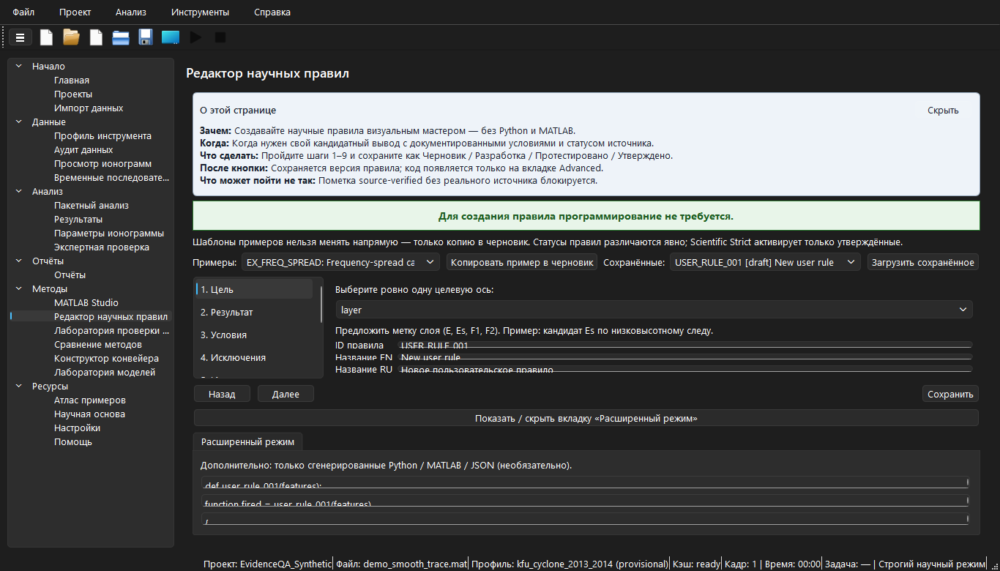

- **Назначение:** Создание версионированных пакетов правил с цитатами.
- **Когда использовать:** При осторожном расширении правил разработки.
- **Предпосылки:** Записываемая область правил.
- **Элементы управления:** Поля мастера; сохранить/экспорт пакета.
- **Эффект:** Пишет метаданные пакета правил.
- **Выход:** Файлы пакета правил.
- **Частая ошибка:** Включение неподдерживаемых числовых порогов URSI.
- **Научное ограничение:** Пользовательские правила требуют независимой валидации.
- **Следующий шаг:** Тестирование правил.

<strong>Тестирование правил</strong>

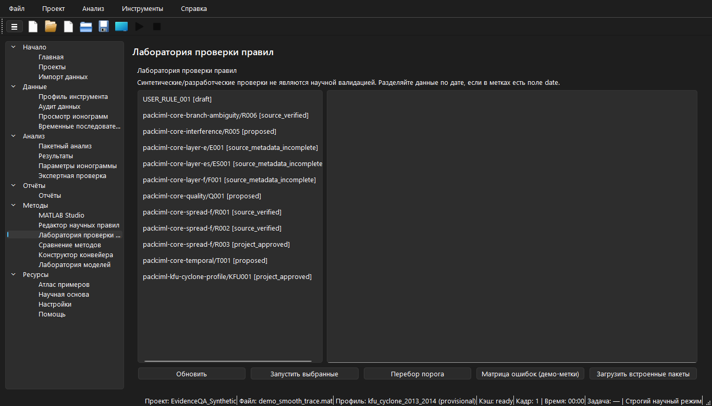

- **Назначение:** Проверка пакетов правил на размеченных/синтетических случаях.
- **Когда использовать:** После правки пакета правил.
- **Предпосылки:** Пакет правил + тест-кейсы.
- **Элементы управления:** Запуск тестов / просмотр различий.
- **Эффект:** Показывает pass/fail и разногласия.
- **Выход:** Отчёты тестов в workspace.
- **Частая ошибка:** Считать синтетический pass внешней валидацией.
- **Научное ограничение:** Не заменяет экспертно подтверждённые наборы.
- **Следующий шаг:** Результаты / Сравнение методов.

<strong>Сравнение методов</strong>

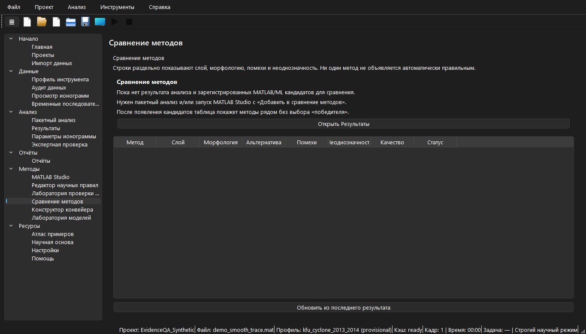

- **Назначение:** Сопоставление строк Python / MATLAB / ML / эксперт.
- **Когда использовать:** Когда есть несколько кандидатов.
- **Предпосылки:** Результат анализа и/или кандидаты MATLAB.
- **Элементы управления:** Обновить.
- **Эффект:** Показывает раздельные оси; без автоматического победителя.
- **Выход:** Нет, пока не экспортировано.
- **Частая ошибка:** Предположение, что один метод объявлен верным.
- **Научное ограничение:** Сравнение не делает ensemble по умолчанию.
- **Следующий шаг:** Конструктор конвейера.

<strong>Конструктор конвейера</strong>

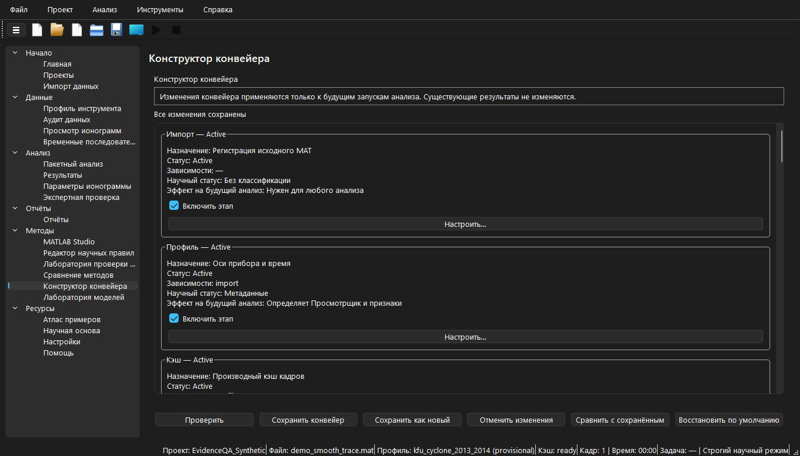

- **Назначение:** Сборка опциональных этапов (не включает MATLAB/ML молча).
- **Когда использовать:** При документировании порядка этапов.
- **Предпосылки:** Контекст проекта.
- **Элементы управления:** Переключатели этапов / сохранить конвейер.
- **Эффект:** Сохраняет определение конвейера для запусков.
- **Выход:** Файлы конфигурации конвейера.
- **Частая ошибка:** Включение недоверенных плагинов без проверки.
- **Научное ограничение:** Пакет по умолчанию остаётся Python RuleEngine, пока не изменён.
- **Следующий шаг:** Пакетный анализ.

<strong>Лаборатория моделей</strong>

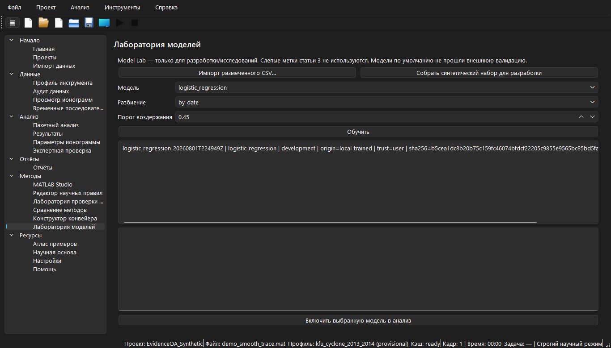

- **Назначение:** Обучение/сравнение ML для разработки; в анализе по умолчанию выключено.
- **Когда использовать:** Только исследовательское прототипирование.
- **Предпосылки:** Размеченный CSV или синтетический набор.
- **Элементы управления:** Импорт CSV; Синтетика; Обучить; Включить модель.
- **Эффект:** Обучает модели разработки с локальными метриками.
- **Выход:** Карточки моделей в model_lab/.
- **Частая ошибка:** Включение чужого joblib без осторожности к trust.
- **Научное ограничение:** Не валидировано внешне; не конвейер по умолчанию.
- **Следующий шаг:** Настройки / Сравнение методов.

<strong>Настройки</strong>

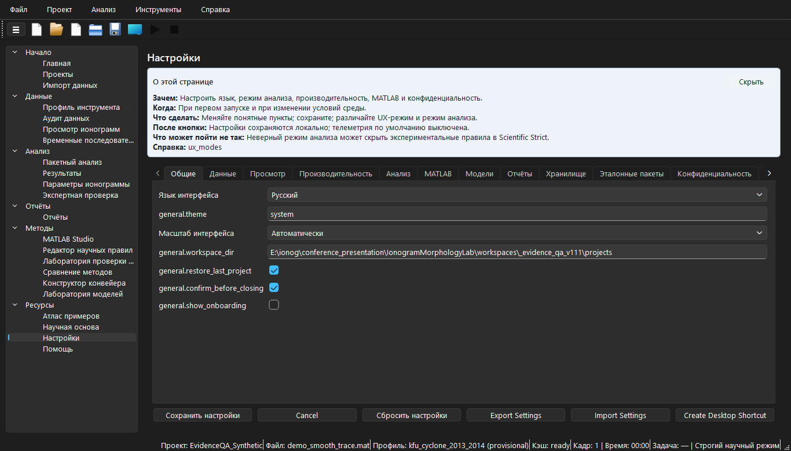

- **Назначение:** Язык, масштаб, хранение, backend MATLAB, приватность.
- **Когда использовать:** Когда нужна конфигурация.
- **Предпосылки:** Записываемое хранилище настроек.
- **Элементы управления:** Вкладки Общие…Дополнительно; Сохранить/Сброс; действия Storage.
- **Эффект:** Сохраняет предпочтения; не переписывает исходный MAT.
- **Выход:** хранилище настроек / ярлыки.
- **Частая ошибка:** Кэш внутри папок исходных данных.
- **Научное ограничение:** Настройки не меняют научные пороги молча.
- **Следующий шаг:** Справка.

<strong>Справка</strong>

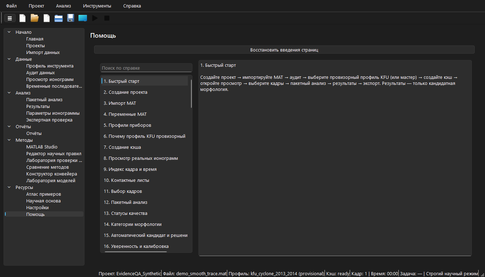

- **Назначение:** Темы справки и восстановление введений.
- **Когда использовать:** Когда неясен смысл элемента.
- **Предпосылки:** Встроенное содержимое справки.
- **Элементы управления:** Поиск; список тем; Восстановить введения.
- **Эффект:** Показывает локализованный текст справки.
- **Выход:** Нет.
- **Частая ошибка:** Пропуск Справки, когда результат выглядит «подтверждённым».
- **Научное ограничение:** Текст справки — руководство, не валидация.
- **Следующий шаг:** Вернуться к процессу на Главной.

## Карта документации

| Документ | Роль |
|----------|------|
| [USER_GUIDE_RU.md](docs/USER_GUIDE_RU.md) | Полный справочник элементов управления |
| [USER_GUIDE_EN.md](docs/USER_GUIDE_EN.md) | Complete control reference |
| [SCIENTIFIC_DECISION_MAP.md](docs/SCIENTIFIC_DECISION_MAP.md) | Путь анализа по умолчанию |

## Лицензия / цитирование

См. `LICENSE` и пакеты научных утверждений. Указывайте версию IML **1.1.1** и id запуска из Отчётов.
