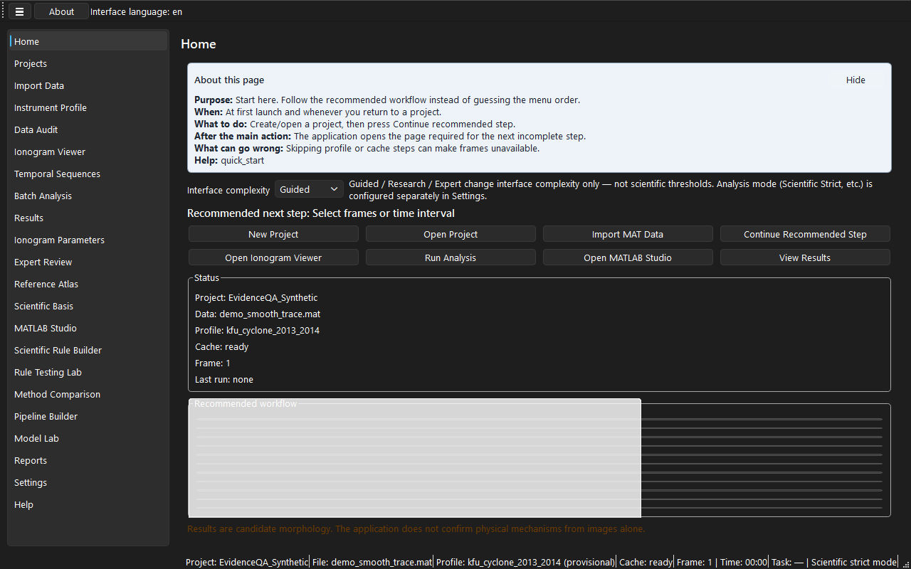

# Ionogram Morphology Lab

[English](README.md) | [Русский](README_RU.md) · **Версия 1.1.1**

Ionogram Morphology Lab (IML) — двуязычное (EN/RU) настольное исследовательское приложение для **прослеживаемого к источнику анализа морфологии ионограмм**, экспертной проверки, тестирования правил и экспорта отчётов. Импортирует выбранные пользователем данные MATLAB (`.mat`), сохраняет provenance (происхождение данных и параметров расчёта) и разделяет морфологию, неоднозначность, качество и параметрические предложения по **отдельным научным осям**.

> **Научный статус:** результат — **кандидатная** морфология или оценка параметра, согласованная с изображением. Это **не** установление физического механизма, **не** замена экспертного масштабирования и **не** валидация модели. Разработческие модели и пользовательские правила требуют независимой доменной проверки.



*Alt: панель Home с рекомендуемым workflow и выбором UX-режима (English).*


*Alt: панель Home с рекомендуемым workflow и выбором UX-режима (Russian).*

Учебные PNG сняты только с синтетических проектов. Схематические SVG-макеты — в [`docs/assets/schematics/`](docs/assets/schematics/).

## Назначение

IML поддерживает задачи радиофизики ионосферы, где аналитику необходимо:

- просматривать кадры ионограмм с документированным контекстом прибора;
- фиксировать кандидатные метки морфологии с неопределённостью и альтернативами;
- применять версионированные правила со ссылкой на источник в тестируемом виде;
- экспортировать двуязычные отчёты и переносимые пакеты проекта без неявной перезаписи исходных данных.

Приложение **локальное**: базовый анализ не требует MATLAB, Octave или сети.

## Возможности

| Область | Что даёт IML |
|---------|--------------|
| **Импорт и аудит** | MAT v5/v7 (SciPy) и v7.3/HDF5 (h5py), Data Audit, профили приборов |
| **Просмотр и кэш** | Навигация по кадрам, MAT только для чтения, производный кэш Zarr по запросу |
| **Анализ** | Пакетные предложения морфологии, отдельные оси качества/неоднозначности/помех |
| **Экспертная проверка** | Принять / Изменить / Неопределённо / Н/П (Accept / Change / Indeterminate / N/A) с обязательным обоснованием |
| **Правила** | Мастер Rule Builder без кода, Rule Testing Lab, устанавливаемые пакеты правил |
| **Отчёты** | CSV, JSON, HTML, Markdown с полями provenance |
| **MATLAB Studio** | Локальная библиотека скриптов, манифесты, контролируемый запуск backend |
| **Model Lab** | Интерпретируемые классификаторы только для разработки (не production ML) |
| **Переносимость** | Пакеты проекта без исходного MAT по умолчанию; опциональное перепривязывание путей |

## Платформы

- **Основная:** Windows 10/11 (portable и GUI на PySide6).
- **Разработка:** Python 3.10+ на Windows, Linux или macOS из исходников.
- **Опционально:** MATLAB или Octave при явной настройке backend для MATLAB Studio.

CI выполняется на Ubuntu с Python 3.11; MATLAB и дисплей **не** требуются.

## Установка

См. [Installation (EN)](docs/INSTALLATION_EN.md) или [Установка (RU)](docs/INSTALLATION_RU.md).

**Portable:** распакуйте каталог релиза, сохраните файлы вместе, используйте **доступный для записи workspace** вне папки установки.

**Из исходников:**

```bash
python -m venv .venv
.venv\Scripts\activate
pip install -e ".[dev]"
python -m ionogram_morphology_lab.app.main
```

Проверка: `python -m pytest` и `python scripts/validate_version_consistency.py`.

## Быстрый старт

1. [Quick Start (EN)](docs/QUICK_START_EN.md) или [Быстрый старт (RU)](docs/QUICK_START_RU.md).
2. При первом запуске выберите язык (**Settings → General → Interface language**).
3. На **Home** создайте **New Project** в доступной папке workspace.
4. Начните с учебных файлов [`synthetic_data/`](synthetic_data/) перед исследовательскими данными.
5. На Home следуйте рекомендуемому порядку (**Continue recommended step**).

## Рабочий процесс MAT

1. **Import Data** — файл или папка `.mat`; проверьте **Data Audit**.
2. **Instrument Profile** — выберите или создайте профиль; provisional помечайте явно.
3. **Viewer** — кадр; **Build cache** только для производного Zarr (исходный MAT не перезаписывается).
4. **Batch Analysis** — запуск; **Results** (предложения не являются финальной классификацией).
5. **Expert Review** — решение и обоснование; **Save expert edits**.
6. **Reports → Export** — отчёт EN/RU; сохраните manifest и provenance.

Подробнее: [Форматы данных](docs/DATA_FORMATS.md), [полное руководство (RU)](docs/COMPLETE_USER_MANUAL_RU.md) · [EN](docs/COMPLETE_USER_MANUAL_EN.md).

## Научные оси

| Ось | Роль |
|-----|------|
| **Качество данных** | Пригодность кадра для анализа |
| **Видимая морфология** | Кандидатная метка по изображению |
| **Неоднозначность** | Альтернативы и флаги расхождения |
| **Помехи** | Загрязнение сигнала (contamination) / маскирование |
| **Параметры** | Оценки методом с указанными единицами |
| **Решение эксперта** | Человеческое переопределение с аудитом |

[Научные ограничения (RU)](docs/SCIENTIFIC_LIMITATIONS_RU.md) · [EN](docs/SCIENTIFIC_LIMITATIONS_EN.md).

## MATLAB Studio

Опциональная среда для импорта, документирования, версионирования и **опционального выполнения** скриптов `.m` на производных входах. Импортированный код **не верифицирован** до вашей оценки. Запуск через явные backend (MATLAB Engine, внешний MATLAB/Octave через `subprocess` со списком аргументов, без `shell=True`). См. [Plugin architecture](docs/PLUGIN_ARCHITECTURE.md).

## Rule Builder (без кода)

**Создание пользовательского правила не требует программирования.** Мастер **Rule Builder** ведёт по шагам:

**Назначение → Условия → Результат → Источник → Тест → Сохранение**

| Шаг | Что задаётся |
|-----|--------------|
| **Назначение (Purpose)** | Rule ID, названия EN/RU, целевая научная ось |
| **Условия (Conditions)** | Признаки, операторы, пороги с единицами, abstention |
| **Результат (Result)** | Кандидатный токен при срабатывании |
| **Источник (Source)** | Библиографические ID, допущения, ограничения, статус верификации |
| **Тест (Test)** | Rule Testing Lab на размеченной dev-выборке |
| **Сохранение (Save)** | Версионированный snapshot YAML |

Сгенерированный код — **предпросмотр** для проверки, не научное одобрение. Тестируйте в **Rule Testing Lab**. [CUSTOM_RULE_BUILDER_RU.md](docs/CUSTOM_RULE_BUILDER_RU.md) · [EN](docs/CUSTOM_RULE_BUILDER_EN.md).

## Статус Model Lab

**Model Lab** обучает интерпретируемые модели scikit-learn на размеченных данных разработки. Карточки моделей по умолчанию: **development / research use only**. Артефакты `joblib` в дереве проекта считайте **ненадёжными**, если получены извне. Это **не** валидированный production ML.

## Ограничения

- Морфология по одному изображению часто **неоднозначна**.
- Синтетические данные проверяют интерфейс и код, а **не** геофизическую истинность.
- Внутренние тесты правил **не** доказывают переносимость между станциями и эпохами.
- Поддерживаются форматы MAT, проверенные в разработке и вашем аудите — **не** заявляется универсальная совместимость.
- IML не заменяет институциональный контроль доступа, шифрование или криптоподпись записей.

## Конфиденциальность

- Телеметрия по умолчанию **выключена**.
- Исходные MAT в обычном режиме **только для чтения**.
- Отчёты и логи могут содержать **локальные пути** — проверяйте перед отправкой.
- Не прикладывайте ограниченные ионограммы или учётные данные к публичным issues.

## Скриншоты

PNG с живого UI (только синтетические учебные данные): [`docs/assets/screenshots/`](docs/assets/screenshots/). Пересъёмка: [`scripts/capture_release_screenshots.py`](scripts/capture_release_screenshots.py). Схематические SVG — [`docs/assets/schematics/`](docs/assets/schematics/); это **не** скриншоты.

| Экран | PNG (EN) | PNG (RU) |
|-------|----------|----------|
| Home | [home_en.png](docs/assets/screenshots/home_en.png) | [home_ru.png](docs/assets/screenshots/home_ru.png) |
| Import MAT | [mat_import_en.png](docs/assets/screenshots/mat_import_en.png) | [mat_import_ru.png](docs/assets/screenshots/mat_import_ru.png) |
| Data Audit | [data_audit_en.png](docs/assets/screenshots/data_audit_en.png) | [data_audit_ru.png](docs/assets/screenshots/data_audit_ru.png) |
| Instrument Profile | [instrument_profile_en.png](docs/assets/screenshots/instrument_profile_en.png) | [instrument_profile_ru.png](docs/assets/screenshots/instrument_profile_ru.png) |
| Viewer | [ionogram_viewer_en.png](docs/assets/screenshots/ionogram_viewer_en.png) | [ionogram_viewer_ru.png](docs/assets/screenshots/ionogram_viewer_ru.png) |
| Results | [results_en.png](docs/assets/screenshots/results_en.png) | [results_ru.png](docs/assets/screenshots/results_ru.png) |
| Rule Builder | [rule_builder_en.png](docs/assets/screenshots/rule_builder_en.png) | [rule_builder_ru.png](docs/assets/screenshots/rule_builder_ru.png) |
| Rule Testing Lab | [rule_testing_en.png](docs/assets/screenshots/rule_testing_en.png) | [rule_testing_ru.png](docs/assets/screenshots/rule_testing_ru.png) |
| MATLAB Studio | [matlab_studio_en.png](docs/assets/screenshots/matlab_studio_en.png) | [matlab_studio_ru.png](docs/assets/screenshots/matlab_studio_ru.png) |
| Settings | [settings_en.png](docs/assets/screenshots/settings_en.png) | [settings_ru.png](docs/assets/screenshots/settings_ru.png) |
| Help | [help_en.png](docs/assets/screenshots/help_en.png) | [help_ru.png](docs/assets/screenshots/help_ru.png) |

## Документация

| Тема | English | Русский |
|------|---------|---------|
| Быстрый старт | [QUICK_START_EN.md](docs/QUICK_START_EN.md) | [QUICK_START_RU.md](docs/QUICK_START_RU.md) |
| Установка | [INSTALLATION_EN.md](docs/INSTALLATION_EN.md) | [INSTALLATION_RU.md](docs/INSTALLATION_RU.md) |
| Руководство | [COMPLETE_USER_MANUAL_EN.md](docs/COMPLETE_USER_MANUAL_EN.md) | [COMPLETE_USER_MANUAL_RU.md](docs/COMPLETE_USER_MANUAL_RU.md) |
| Методы морфологии | [MORPHOLOGY_METHODS_EN.md](docs/MORPHOLOGY_METHODS_EN.md) | [MORPHOLOGY_METHODS_RU.md](docs/MORPHOLOGY_METHODS_RU.md) |
| Оценка параметров | [PARAMETER_ESTIMATION_EN.md](docs/PARAMETER_ESTIMATION_EN.md) | [PARAMETER_ESTIMATION_RU.md](docs/PARAMETER_ESTIMATION_RU.md) |
| Rule Builder | [CUSTOM_RULE_BUILDER_EN.md](docs/CUSTOM_RULE_BUILDER_EN.md) | [CUSTOM_RULE_BUILDER_RU.md](docs/CUSTOM_RULE_BUILDER_RU.md) |
| Тестирование правил | [RULE_TESTING_GUIDE_EN.md](docs/RULE_TESTING_GUIDE_EN.md) | [RULE_TESTING_GUIDE_RU.md](docs/RULE_TESTING_GUIDE_RU.md) |
| Устранение неполадок | [TROUBLESHOOTING_EN.md](docs/TROUBLESHOOTING_EN.md) | [TROUBLESHOOTING_RU.md](docs/TROUBLESHOOTING_RU.md) |
| FAQ | [FAQ_EN.md](docs/FAQ_EN.md) | [FAQ_RU.md](docs/FAQ_RU.md) |
| Безопасность | [SECURITY.md](SECURITY.md) · [Threat model](docs/THREAT_MODEL.md) · [Audit v1.1.1](docs/SECURITY_AUDIT_V1_1_1.md) |

Архитектура: [ARCHITECTURE.md](docs/ARCHITECTURE.md) · [DEVELOPER_SETUP.md](docs/DEVELOPER_SETUP.md).

## Разработка и тесты

```bash
pip install -e ".[dev]"
python -m pytest
python scripts/check_repository_hygiene.py
python scripts/validate_readme.py
python scripts/validate_version_consistency.py
python scripts/validate_docs.py
```

MATLAB для CI не требуется. Проходящие тесты **не** заменяют доменную валидацию.

## Участие

[CONTRIBUTING.md](CONTRIBUTING.md), [CODE_OF_CONDUCT.md](CODE_OF_CONDUCT.md). Обновляйте EN и RU документацию вместе. Не коммитьте секреты, private MAT, workspace и артефакты сборки.

## Цитирование

[CITATION.cff](CITATION.cff), версия **1.1.1**, 2026-08-01. Укажите URL репозитория перед публикацией.

## Лицензия

[MIT License](LICENSE). Сторонние компоненты: [THIRD_PARTY_NOTICES.md](THIRD_PARTY_NOTICES.md), [LICENSE_STATUS.md](LICENSE_STATUS.md).

## Релиз 1.1.1

| Параметр | Значение |
|----------|----------|
| Версия | 1.1.1 |
| Дата | 2026-08-01 |
| Changelog | [CHANGELOG.md](CHANGELOG.md) |
| Фокус | Usability (Home, UX-режимы, Rule Builder, Help), документация, hygiene CI, усиление безопасности импортов и отчётов |

Уязвимости — приватно по [SECURITY.md](SECURITY.md).
