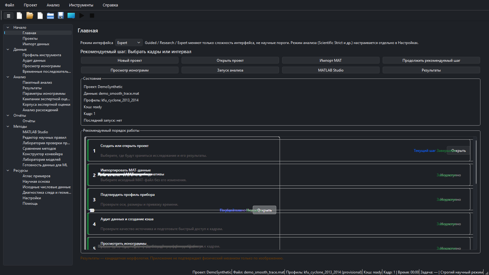
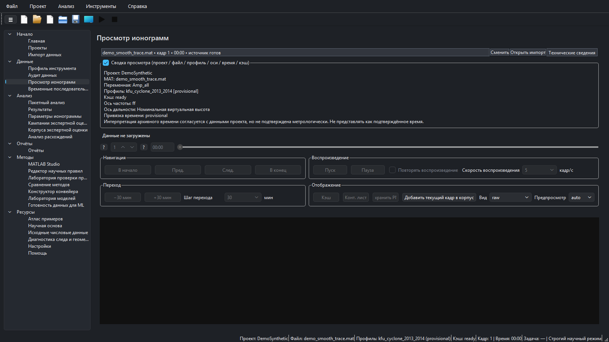
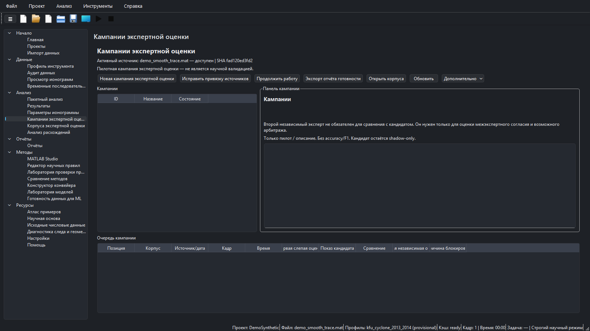
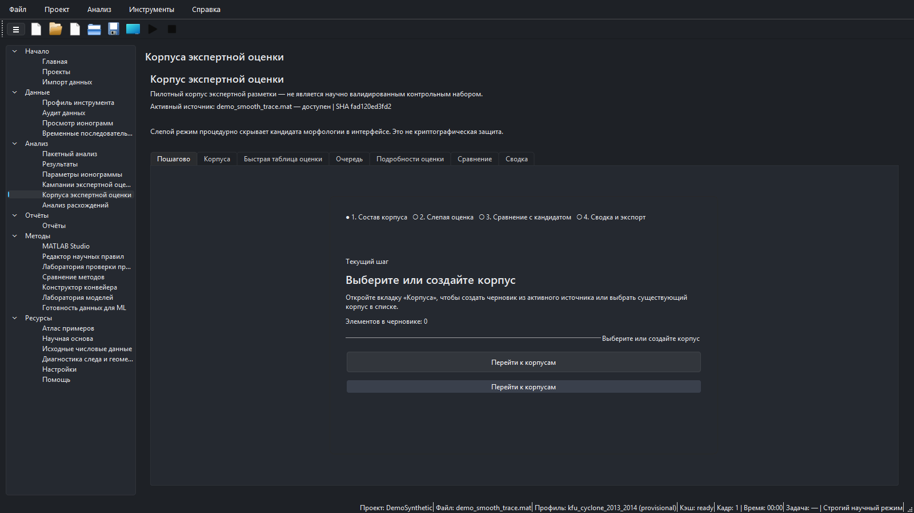
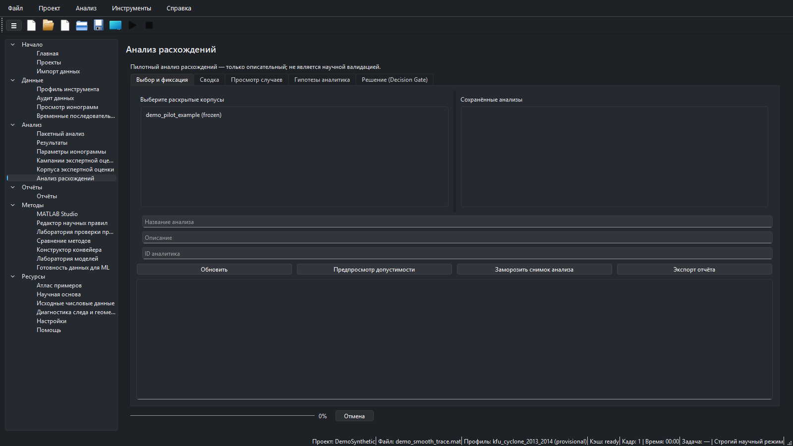
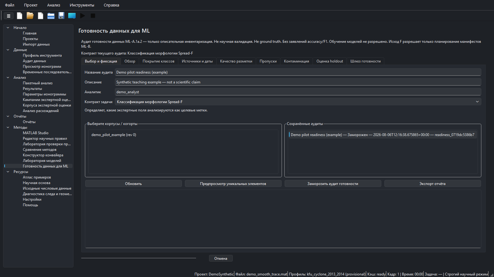
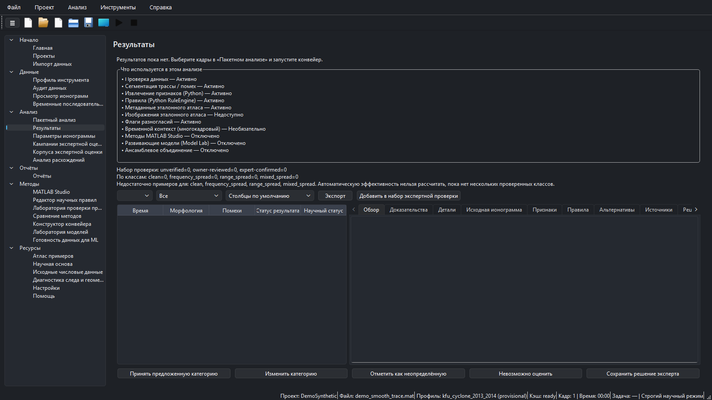

# Ionogram Morphology Lab

[English](README.md) | [Русский](README_RU.md) · **Релиз 1.1.1** · **Build Identity: ML-A.1a.2**

Ionogram Morphology Lab (IML) — двуязычное (EN/RU) настольное исследовательское приложение для **трассируемого анализа морфологии ионограмм**, экспертных кампаний проверки, анализа расхождений, аудитов готовности данных, тестирования правил и экспорта отчётов. Импортирует выбранные пользователем MATLAB (`.mat`) данные, сохраняет происхождение и держит морфологию, неоднозначность, качество и параметры на **раздельных научных осях**.

> **Научный статус:** результат — **кандидат** морфологии или предложения параметра. Это **не** доказательство физического механизма, не замена экспертного скейлинга и не валидация модели. Экспертные метки — решения человека, а не ground truth. Модели разработки и пользовательские правила требуют независимой валидации. **Готовность данных для ML** — только описательный аудит и **не** разрешает обучение моделей.



*Главная — рекомендуемый процесс на синтетических демо-данных (`DemoSynthetic` / `demo_smooth_trace.mat`). Снимки: `docs/assets/screenshots/ml-a1a2/`.*

## Возможности

- Локальный импорт MAT с инвентарём / аудитом (исходные файлы не перезаписываются)
- Просмотрщик ионограмм, временные последовательности, пакетный анализ, двуязычные отчёты
- Путь Python RuleEngine по умолчанию (MATLAB Studio и Model Lab — опциональны / не по умолчанию)
- Корпуса и кампании экспертной проверки со слепыми кругами, раскрытием/сравнением и арбитражем
- Анализ расхождений (описательный; ни эксперт, ни кандидат не считаются ground truth)
- **Готовность данных для ML (ML-A.1a.2):** инвентарь, покрытие классов, источники/даты, контаминация, оценка holdout, Gate A–F (F = только планирование ML-B)
- Интерфейс, справка и документация EN/RU

## Сравнение модулей

| Модуль | Назначение | Даёт | **Не** делает |
|--------|------------|------|----------------|
| Импорт / Аудит / Профиль | Регистрация MAT, инвентарь, оси прибора | Артефакты инвентаря / аудита | Классификацию морфологии |
| Просмотрщик / Последовательности | Просмотр кадров и времени | Отображение / контактные листы | Экспертные метки или обучающие наборы |
| Пакет / Результаты | Кандидатный конвейер Python | Кандидаты + происхождение запуска | Подтверждённую науку / URSI-скейлинг |
| Корпуса экспертной проверки | Слепые оценки на замороженных когортах | Заблокированные отзывы, reveal/compare | Ground truth; разрешение обучения |
| Кампании экспертной проверки | Операции пилота по многим источникам/датам | Манифесты / прогресс кампании | Заявления о научной валидации |
| Анализ расхождений | Описать паттерны эксперт↔кандидат / эксперт↔эксперт | Замороженный описательный снимок + gate | Accuracy/F1; объявить победителя |
| Готовность данных для ML | Готовность данных/меток для контракта задачи | Замороженный аудит + экспорт | Обучение моделей; финальные holdout-манифесты |
| MATLAB Studio / Model Lab | Опциональные методы / прототипирование | Артефакты Studio / model_lab | Анализ по умолчанию |
| Конструктор / Тест правил | Версионированные пакеты правил | Пакеты / отчёты тестов | Внешнюю валидацию сами по себе |

## Сквозной пользовательский процесс

1. **Установите или распакуйте** приложение; рабочая область — вне папки установки; выберите EN или RU.
2. **Создайте или откройте проект** (Проекты). Для первых запусков используйте `synthetic_data/`.
3. **Импортируйте MAT** без перезаписи источника; подтвердите **профиль прибора**; выполните **аудит данных**.
4. **Просмотрите** кадры; при необходимости постройте временные последовательности.
5. Запустите **пакетный анализ** (путь Python по умолчанию); смотрите **Результаты** только как кандидатов.
6. Соберите **корпус экспертной проверки**, завершите **слепые** круги, затем раскрытие/сравнение (кампании — при многих источниках/датах).
7. При необходимости выполните **Анализ расхождений** по раскрытым корпусам (только описание).
8. Запустите **Готовность данных для ML** для выбранного контракта задачи; заморозьте аудит; прочитайте Gate. Исход **F** — только *планирование* ML-B, **без обучения**.
9. Экспортируйте отчёты / аудиты готовности. Исследовательские MAT и runtime-аудиты не помещайте в git.

## Избранные снимки (ML-A.1a.2)

PNG 1600×900 из UI ML-A.1a.2 на синтетических/демо-метках. Без личных путей и учётных данных. У каждой сцены есть пара EN/RU в `docs/assets/screenshots/ml-a1a2/`.

<details>
<summary><strong>Главная</strong></summary>


*Главная — вход и рекомендуемый процесс. EN: `home_en.png`.*

</details>

<details>
<summary><strong>Просмотрщик ионограмм</strong></summary>



*Просмотрщик — осмотр кадров до/после анализа. EN: `ionogram_viewer_en.png`.*

</details>

<details>
<summary><strong>Кампании экспертной проверки</strong></summary>



*Кампании — пилот по многим источникам/датам. EN: `campaigns_en.png`.*

</details>

<details>
<summary><strong>Корпуса экспертной проверки</strong></summary>



*Корпуса — слепая оценка, вход в reveal/compare. EN: `expert_review_en.png`.*

</details>

<details>
<summary><strong>Анализ расхождений</strong></summary>



*Анализ расхождений — только описательный снимок. EN: `disagreement_analysis_en.png`.*

</details>

<details>
<summary><strong>Готовность данных для ML</strong></summary>



*Готовность данных для ML — выбор/заморозка аудита (пример пилота). EN: `ml_data_readiness_en.png`.*

</details>

<details>
<summary><strong>Результаты</strong></summary>



*Результаты — автоматические кандидаты не равны подтверждению эксперта. EN: `results_en.png`.*

</details>

Дополнительные исторические снимки страниц: [`docs/assets/screenshots/v1.1.1/`](docs/assets/screenshots/v1.1.1/) (на них всё ещё ссылаются некоторые вторичные документы).

## Быстрый старт

См. [Руководство пользователя](docs/USER_GUIDE_RU.md), [Установка](docs/INSTALLATION_RU.md). Portable: распакуйте, держите файлы вместе, используйте записываемую рабочую область вне папки установки.

```bash
python -m venv .venv
.venv\Scripts\activate
pip install -e ".[dev]"
python -m ionogram_morphology_lab.app.main
```

Упакованный EXE (при распространении): запускайте `IonogramMorphologyLab.exe` из portable-папки. Принятый Build Identity для фазы готовности: **ML-A.1a.2**.

1. Выберите язык · 2. Новый проект · 3. Начните с `synthetic_data/` · 4. Следуйте шагам на Главной.

## Проекты и данные MAT

- Проект хранит метаданные, кэши, запуски, корпуса/кампании и аудиты готовности.
- Импорт регистрирует выбранный пользователем путь `.mat`; IML не перезаписывает `Amp_all` и другие исходные массивы.
- Для демо и документации предпочтительны учебные файлы в `synthetic_data/`.
- Исследовательские MAT, локальные БД и сгенерированные экспорты review/readiness не коммитьте.

## Корпуса, кампании и слепая проверка

- **Корпуса экспертной проверки** — замороженные когорты, слепые отзывы, reveal/compare, опциональный арбитраж.
- **Кампании** организуют пилот по многим источникам/датам без заявлений о научной валидации.
- Слепые круги должны быть завершены до раскрытия; метки кандидатов не должны попадать в слепой просмотр.
- Исправленные отзывы — ревизии с происхождением, а не независимые вторые мнения, если не зафиксирован отдельный рецензент/круг.

## Анализ расхождений

Только для чтения описательный слой над раскрытыми корпусами/кампаниями (`iml-disagreement-analysis-0.1.0`). Суммирует переходы и страты, фиксирует decision gate аналитика. Не объявляет ground truth и не считает accuracy.


*Анализ расхождений — вкладка выбора/заморозки; синтетическая когорта `demo_pilot_example`.*

## Готовность данных для ML (ML-A.1a.2)

Протокол: `iml-ml-dataset-readiness-0.1.0`. Shadow-only аудит и управление:

- Инвентарь экспертно размеченных элементов для контракта задачи (семейство A–D)
- Покрытие классов, пропуски, независимость рецензентов
- Проверки контаминации (элементы, уже виденные в разработке; связанные группы кадров; последовательности)
- **Оценка** возможности holdout (не финальный holdout-набор)
- Исходы Gate A–F; **F разрешает только планирование манифестов ML-B**
- Всегда: `authorizes_training=False`; без заявлений accuracy/F1/sensitivity/specificity


*Готовность данных для ML — выбор и заморозка. Подзаголовок страницы фиксирует ограничения аудита.*

### Пример пилота (только пример)

На снимках показан **синтетический учебный пример** с названием `Demo pilot readiness (example)` и когортой `demo_pilot_example`. Это **не** научное утверждение о каком-либо исследовательском корпусе. Небольшой концентрированный пилот с ограниченными датами/источниками и малым числом независимых вторых отзывов обычно даёт исходы Gate A, C, D или E — это ожидаемый результат готовности, а не сбой ПО.

## Целостность и контаминация

- Метки кандидатов исключаются из экспертных целевых распределений покрытия готовности.
- Элементы, уже виденные в disagreement/разработке, не входят в «нетронутый» holdout как чистые.
- Связанные группы кадров / последовательности не считаются случайно разделимыми единицами.
- Замороженные аудиты неизменяемы; исправленные ревизии получают новый identity и сохраняют родителя.
- Даты съёмки следуют документированному порядку авторитета; время кадра не подменяет дату источника.
- Экспорт убирает абсолютные пути владельца там, где это требуют контракты readiness/disagreement.

## Установка и запуск (проверенные пути)

| Путь | Примечание |
|------|------------|
| Dev: `pip install -e ".[dev]"` затем `python -m ionogram_morphology_lab.app.main` | Для разработчиков |
| Portable EXE | Распаковать папку; запускать EXE; workspace вне каталога установки |
| MATLAB | Опционально; не нужен для анализа Python по умолчанию |

## Разработка и проверка

Типичные проверки:

```bash
python -m pytest
python scripts/validate_feature_registry_v2.py
python scripts/validate_synthetic_geometry_v2.py
python scripts/validate_ml_dataset_readiness.py
python scripts/validate_morphology_disagreement_analysis.py
python scripts/validate_i18n.py
python scripts/validate_docs.py
python scripts/check_repository_hygiene.py
```

Доказательства release gate для ML-A.1a.2 (уже выполнены): **769** pytest; валидаторы + hygiene OK; owner visual QA PASS; принятый SHA-256 EXE `67FBB83E6BCECF2A58C719A57AF5E60B9E74FCB31EB1FC130B8BD8DAE6A6A246`. См. [`docs/MLA1_FINAL_RELEASE_GATE_REPORT.md`](docs/MLA1_FINAL_RELEASE_GATE_REPORT.md).

## Структура репозитория (кратко)

| Путь | Роль |
|------|------|
| `src/ionogram_morphology_lab/` | Пакет приложения (UI, анализ, готовность, review) |
| `scripts/` | Валидаторы и утилиты |
| `tests/` | Pytest |
| `docs/` | Руководства, отчёты приёмки, снимки |
| `synthetic_data/` | Учебные MAT |
| `rule_packs/` | Версионированные пакеты правил |
| `dist/` | Локальные сборки (не коммитятся) |

## Безопасность runtime и git

**Не коммитьте:** владелецские MAT, runtime `review_dataset/`, экспорты readiness/disagreement, локальные workspace, кэши, `build/`, `dist/`, личные настройки, секреты. Ориентируйтесь на списки включения в отчётах фаз / final gate.

## Устранение неполадок

| Симптом | Что проверить |
|---------|----------------|
| Пустой просмотрщик | Проект + MAT + профиль; пересобрать кэш после аудита |
| Пакет «не использовал» MATLAB/ML | Путь по умолчанию — Python RuleEngine (ожидаемо) |
| Раскрытие слепой проверки заблокировано | Сначала завершите обязательный слепой круг |
| Gate не F / нет обучения | Обучение никогда не разрешается; F — только планирование |
| Прогресс «завис» после freeze | В ML-A.1a.2 успех должен быть на 100%, Cancel отключён |
| Абсолютные пути в экспорте | Используйте экспорт по контракту; не коммитьте исследовательские данные |

## Дорожная карта

- **Сделано (эта фаза):** ML-A.1 → ML-A.1a.2 готовность данных (shadow-only).
- **Не начато:** **ML-B** (манифесты train/dev/holdout и любой workflow обучения).
- MATLAB Studio / Model Lab остаются опциональными исследовательскими поверхностями.

## Карта документации

| Документ | Роль |
|----------|------|
| [USER_GUIDE_RU.md](docs/USER_GUIDE_RU.md) | Полный справочник элементов управления |
| [USER_GUIDE_EN.md](docs/USER_GUIDE_EN.md) | Complete control reference |
| [SCIENTIFIC_DECISION_MAP.md](docs/SCIENTIFIC_DECISION_MAP.md) | Путь анализа по умолчанию |
| [MLA1_FINAL_RELEASE_GATE_REPORT.md](docs/MLA1_FINAL_RELEASE_GATE_REPORT.md) | Release gate ML-A.1a.2 |
| [MLA1_README_SCREENSHOT_REFRESH_REPORT.md](docs/MLA1_README_SCREENSHOT_REFRESH_REPORT.md) | Обновление README/снимков |

## Лицензия / цитирование

См. `LICENSE` и пакеты научных утверждений. Указывайте версию IML **1.1.1**, Build Identity **ML-A.1a.2** и id запуска из Отчётов.
