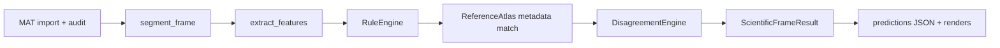

# Scientific Decision Map — IonogramMorphologyLab v1.1.1

Living map of how scientific concepts become (or do not become) automatic decisions in the product.

**Default production batch path:** `batch_analyze` → `analyze_frame` in `projects/pipeline.py` runs **Python RuleEngine only**. MATLAB Studio, Model Lab (ML), and ensemble fusion are **not** invoked on this path unless separately enabled and wired by the user in development workflows.

**Epistemic rule (mandatory):** Books and articles provide **definitions** and **source-linked criteria**. They become **machine logic** only when explicitly encoded in the rule pack (`knowledge_base/RULE_PACK_IML1.csv` / `rules/engine.py`) and covered by automated tests. The application **does not** claim that literature trained the classifier, and **does not** claim independent external scientific validation of automatic outputs.

---

## Status legend

| Tag | Meaning |
|-----|---------|
| **Active (default pipeline)** | Runs on every `full_pipeline` frame analysis unless quality gates stop earlier |
| **Optional** | Available in UI or scripts; off or not merged into default batch |
| **Metadata-only** | Citations / terminology / descriptors; no redistributed comparison images |
| **Source-verified** | Rule threshold origin or claim traceable to a documented source definition (not the same as instrument validation) |
| **Development-calibrated** | Numeric thresholds tuned on project archives during development |
| **Expert-confirmed** | Requires human review dataset or expert action; not produced automatically |
| **Independently validated** | **Not claimed** for automatic morphology in v1.1.1 |

---

## 1. Image preprocessing

| Aspect | Detail |
|--------|--------|
| **Role** | Raw ionogram matrices are read from MAT via instrument profile; optional normalization exists for comparison workflows only |
| **Default batch** | **Active** for import/audit; **no** silent normalization on raw view |
| **Implementation** | `importers/adapters.py`, `importers/audit.py`; `preprocessing/normalize.py` (`normalize_for_comparison`) |
| **Raw render** | `render_raw_ionogram` with `scaling_method="none"` — display is not physically recalibrated |
| **Comparison normalize** | **Optional** — `robust_percentile` normalization; labeled `DERIVED_DIAGNOSTIC`; used by `similarity/compare.py`, not by `analyze_frame` |
| **Tags** | Active (import/audit); Optional (comparison normalize); Development-calibrated (percentile parameters) |

---

## 2. Trace extraction (segmentation)

| Aspect | Detail |
|--------|--------|
| **Role** | Heuristic trace / interference masks and ridge map for downstream features |
| **Default batch** | **Active** — `segment_frame` in `segmentation/trace_interference.py` |
| **Method** | Percentile + robust threshold bright mask; vertical-stripe interference heuristic; row-wise ridge from trace mask |
| **Outputs saved** | `masks/*_trace.npy`, `masks/*_interference.npy` |
| **Limitations** | Documented as heuristic/probabilistic; not confirmed physical mode separation |
| **Tags** | Active (default pipeline); Development-calibrated (percentile `92`, stripe column fraction `0.55`); **Not** expert-confirmed; **Not** independently validated |

---

## 3. Feature calculation

| Aspect | Detail |
|--------|--------|
| **Role** | Image-analysis measurements (local ridge FWHM, interference metrics, O/X heuristics, co-location) |
| **Default batch** | **Active** — `extract_features` in `features/extract.py` (version `iml1-0.2.0`) |
| **Registry** | `features/registry.py` — feature definitions and limitations |
| **Key spread gates** | `frequency_evidence_passed`, `range_evidence_passed`, `frequency_evidence_absolute`, `range_evidence_absolute`, `colocated_spread_fraction`, axis balance for mixed |
| **Interference features** | `interference_dominance`, `vertical_stripe_density`, `full_height_stripe_count` |
| **Tags** | Active (default pipeline); Development-calibrated (ridge thickness and gate logic); Source-informed definitions where linked in registry; **Not** independently validated |

---

## 4. Source-based rules (RuleEngine)

| Aspect | Detail |
|--------|--------|
| **Role** | Map feature vector + quality status → candidate morphology and confidence status |
| **Default batch** | **Active** — `RuleEngine().evaluate()` in `rules/engine.py`, pack `RULE_PACK_IML1` |
| **Outputs** | `candidate_morphology`, `final_auto_status`, `activated_rules`, `source_citations`, explanations EN/RU |
| **Prohibited claims** | Engine emits fixed list (e.g. no “confirmed physical mechanism”, no “definite Spread-F event from image alone”) |

### Rule pack summary

| Rule | Category | Source link | Threshold origin | Default pipeline |
|------|----------|-------------|------------------|------------------|
| R001 | frequency | A3L018 p.241 | development_calibration | Active |
| R002 | range | A3L018 p.241 | development_calibration | Active |
| R003 | mixed | A2_PROTOCOL | derived_from_verified_definition | Active |
| R004 | none → clean | A2_PROTOCOL | development_calibration | Active |
| R005 | artifact | A2_PROTOCOL | engineering_default | Active |
| R006 | abstain (O/X) | A3L007 p.15–17 | derived_from_verified_definition | Active |
| R099 | disabled | — | unsupported | Disabled |

**Tags:** Active (default pipeline); Source-verified (wording + claim_id where present); Development-calibrated / engineering_default (numeric thresholds); **Not** expert-confirmed; **Not** independently validated.

---

## 5. Development heuristics (non-source thresholds)

| Aspect | Detail |
|--------|--------|
| **Role** | Engineering defaults where literature does not supply usable Amp_all metrology |
| **Examples** | R005 interference dominance `0.55`, stripe density `0.2`, full-height stripe co-evidence; segmentation stripe detector |
| **Disagreement engine** | **Active** in default batch — flags alternative interpretations (`disagreement/engine.py`) |
| **Temporal context** | Setting `temporal_context: true` in analysis config; sequence fusion **not** merged into default single-frame morphology decision |
| **Tags** | Active (disagreement flags); Development-calibrated; **Not** source-verified as numeric law |

---

## 6. MATLAB methods

| Aspect | Detail |
|--------|--------|
| **Role** | Optional script library / plugins for derived-input analysis, feature experiments, comparison |
| **Default batch** | **Off** — not called from `analyze_frame` |
| **UI** | MATLAB Studio page; backends: MATLAB Engine, external MATLAB, Octave |
| **Scientific status** | Imported scripts default to `imported_unverified`; built-ins may be `built_in_verified` in manifest only |
| **Tags** | Optional; Development-calibrated / unverified until user assessment; **Not** in default pipeline |

---

## 7. Reference atlas

| Aspect | Detail |
|--------|--------|
| **Role** | Source-traceable terminology and nearest-case hints from metadata |
| **Default batch** | **Active** — `ReferenceAtlas().find_nearest()` after rules |
| **Default install** | **Metadata-only** — `knowledge_base/REFERENCE_ATLAS_CASES.csv`; `internal_image_availability` ≠ `available` for all shipped cases |
| **Matching** | Soft descriptor scores + canonical terminology alignment; **not** image registration in default path (`registration_confidence = 0.0` when images unavailable) |
| **Wording** | “Structurally similar to…” — never “same physical event” |
| **Tags** | Active (metadata matching); Metadata-only; Source-verified (citations); **Not** independently validated |

See `docs/REFERENCE_ATLAS_CAPABILITY_AUDIT.md` for per-case audit.

---

## 8. Development ML (Model Lab)

| Aspect | Detail |
|--------|--------|
| **Role** | Train interpretable sklearn models on user-prepared feature matrices |
| **Default batch** | **Off** — `ml_models_enabled: false` in default settings |
| **Implementation** | `classifiers/model_lab.py`; UI Model Lab page |
| **Model kinds** | logistic_regression, SVM, random_forest, gradient_boosting, knn, calibrated_ensemble |
| **Record field** | `model_version: "none"` in default pipeline output |
| **Tags** | Optional; Development-calibrated; **Does not** claim literature-trained classifier; **Not** independently validated |

---

## 9. Ensemble

| Aspect | Detail |
|--------|--------|
| **Role** | Setting `analysis.ensemble` exists; `calibrated_ensemble` is a Model Lab model **kind** |
| **Default batch** | **Off** — no rule+ML+MATLAB fusion in `analyze_frame`; disagreement flags may note `rule_vs_model` if a model category were supplied, but batch does not supply one |
| **Tags** | Optional (setting / Model Lab only); **Not** active in default pipeline |

---

## 10. Final output

| Aspect | Detail |
|--------|--------|
| **Role** | Persist predictions, scientific axes, renders, disagreement, nearest references |
| **Default batch** | **Active** — JSON under run `predictions/`, `features/`, `by_morphology/`, SQLite index |
| **Schema** | `scientific_outputs/result_schema.py` — `ScientificFrameResult` v1.1 |
| **Confidence** | `confidence_score: null`, `confidence_calibration_status: "uncalibrated"` in default batch |
| **User-facing wording** | `wording_en` / `wording_ru`: proposed classification — requires expert review |
| **Tags** | Active; Development-calibrated (automatic labels); Expert-confirmed only after human review workflow |

---

## `normalize_morphology` mapping

Legacy RuleEngine tokens are serialized to v1.1 morphology axis via `normalize_morphology()` / `_LEGACY_MORPH` in `scientific_outputs/result_schema.py`:

| Input (RuleEngine / legacy) | Serialized morphology |
|------------------------------|------------------------|
| `frequency` | `frequency_spread` |
| `range` | `range_spread` |
| `mixed` | `mixed_spread` |
| `none` | `clean` |
| `diffuse` | `diffuse_unspecified` |
| `diffuse_unspecified` | `diffuse_unspecified` |
| `spread_unspecified` | `spread_unspecified` |
| `artifact` | `interference_dominated` |
| `other` | `other_morphology` |
| `abstain` | `indeterminate` |
| `indeterminate` | `indeterminate` |
| `not_assessable` | `not_assessable` |

Values already in `MORPHOLOGY_VALUES` pass through when not in the legacy map.

---

## Separate scientific axes (never one “ionogram type”)

The product deliberately splits decisions across independent axes (`scientific_outputs/taxonomy.py`):

| Axis | Purpose | Typical default-pipeline source |
|------|---------|----------------------------------|
| **Layer** | E / Es / F1 / F2 / … | `indeterminate` from legacy path (layer not inferred automatically in v1.1 batch) |
| **Morphology** | Spread appearance (`clean`, `frequency_spread`, …) | RuleEngine → `normalize_morphology` |
| **Interference** | Diagnostic interference level | Feature `interference_dominance` → `interference_status` (`low` / `dominant` in pipeline record) |
| **Ambiguity** | O/X, branches, overlapping layers | `possible_ox_confusion` → `possible_O_X` or `no_visible_ambiguity` |
| **Quality** | Data fitness | `audit_frame` → `data_quality_status` (`valid`, `degraded`, `not_assessable`, …) |

UI presenters (`ui/presenters.py`) and display tokens (`ui/display_values.py`) localize axis values for humans; exports retain canonical tokens.

---

## Default pipeline flow (concise)

**Not on this diagram by default:** MATLAB Studio, Model Lab inference, ensemble fusion, image-to-image atlas registration.

---

## Related documents

- `docs/MORPHOLOGY_DECISION_AUDIT_V1_1_1.md` — rule-path QA on approved MAT archives
- `docs/REFERENCE_ATLAS_CAPABILITY_AUDIT.md` — atlas case rights and comparability
- `knowledge_base/RULE_PACK_IML1.csv` — rule provenance and threshold origins

## ML-A.1 readiness gate (governance)

Before any ML-B dataset manifests: freeze a candidate-independent label inventory under an explicit task contract; treat disagreement-analysis items as development-exposed; assess holdout feasibility by related-frame group / sequence (never random frames); record Readiness Gate A-F. Expert labels are not ground truth. Parameter-scaling contracts are unsupported by morphology labels alone.

## ML-B.1 dataset manifests (governance)

Above a frozen ML-A audit: build a deterministic leakage graph into atomic groups; reserve train/development/untouched-holdout/excluded roles without splitting protected groups; freeze only when Gate F permits. Public holdout manifests omit item-level targets; reference labels are workflow-sealed until a future ML-E unlock protocol. ML-B does not authorize training or start ML-C.
